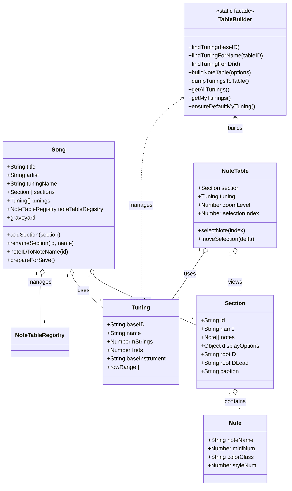

User: can you produce a mermaid class diagram in markdown for the classes Song, NoteTable table-builder, Section, tuning, and any other classes or modules that behave like classes in this web app that starts from infinite-neck.js::appInit? 

GitHub Copilot: Searched codebase for "appInit class Song NoteTable TableBuilder Section tuning class diagram", 15 results

Here is a Mermaid class diagram in markdown for the main classes and class-like modules in your web app, starting from the `appInit` entry point in infinite-neck.js. This diagram includes `Song`, `Section`, `NoteTable`, `TableBuilder`, `Tuning`, and their key relationships, based on your architecture and code structure.



**Notes:**
- `TableBuilder` is a static/facade class, not instantiated.
- `NoteTableRegistry` is referenced in `Song` for managing multiple `NoteTable` instances.
- `Note` is a simple data class for individual notes.
- Relationships are based on composition and usage as inferred from your code and architecture docs.

Let me know if you want a diagram with more or fewer details, or a PNG/SVG export!

User: That's exactly what i wanted.  Can you include the module infinte-


GitHub Copilot: It looks like your message was cut off. Could you please clarify what you want to include about the module "infinite-"? Are you asking to include the module infinite-neck.js in the class diagram, or something else? Please provide the full request so I can help you accurately.

User: That's exactly what i wanted.  Can you include the module infinte-neck.js as a god-class / manager-class?


GitHub Copilot: Read [](file:///home/laramie/infinite-neck/_doco/class-diagram.md#1-1), lines 1 to 40

Read [](file:///home/laramie/infinite-neck/_doco/class-diagram.md#41-41), lines 41 to 73

Read [](file:///home/laramie/infinite-neck/_doco/class-diagram.md#73-73), lines 73 to 73

Generating patch (169 lines) in [](file:///home/laramie/infinite-neck/_doco/class-diagram.md)


```

```
The class diagram has been updated to include the infinite-neck.js module as a god-class/manager-class, showing its orchestration and dependencies with the rest of the architecture. You can view the updated diagram in _doco/class-diagram.md. Let me know if you want further refinements!

Made changes.

User: Can you please interpret jest-flow.txt based on whitespace indentation, and create a parallel jest-flow.md ? Interpret lines starting at the hard return to be true H1.  The others should be outline unordered lists, but any that have code including {} character and bash or js -like syntax should be presented as multi-line code blocks.  The output should be in new file in this directory, that is _doco/flow/jest-flow.md

GitHub Copilot: Created [](file:///home/laramie/infinite-neck/_doco/flow/jest-flow.md)

The file jest-flow.md has been created, interpreting the original jest-flow.txt as a structured markdown outline with code blocks and headings as requested. Let me know if you need any adjustments!

Made changes.

User: That was perfect. thanks. Could you create a TOC at the top, including the H1 tags and the first level bullet points below them, please?

GitHub Copilot: Read [](file:///home/laramie/infinite-neck/_doco/flow/jest-flow.md#1-1), lines 1 to 100

Read [](file:///home/laramie/infinite-neck/_doco/flow/jest-flow.md#101-101), lines 101 to 145

Generating patch (23 lines) in [](file:///home/laramie/infinite-neck/_doco/flow/jest-flow.md)


```

```
A Table of Contents has been added to the top of jest-flow.md, including H1 tags and the first-level bullet points, with anchor links for easy navigation. Let me know if you want any further refinements!

Made changes.

User: I'd like to create index documents for my top level README.md to point to, detailing the contents of _doco/design/ and _doco/lifecycle/.  However, these are active directories, with weekly additions planned.  What is a good way to make index files with extra notes added by programmers as they create the documents, that is, editing either another md file, or the index.md files themselves?  We are open to a weekly or daily process of having Copilot update the index files as part of developer flow.

GitHub Copilot: A good approach for maintaining up-to-date index files for active documentation directories like _doco/design/ and _doco/lifecycle/ is:

1. **Create an index.md file in each directory** (e.g., _doco/design/index.md, _doco/lifecycle/index.md).
2. **Structure the index.md** as a list of links to each document in the directory, with a short description or notes for each file.
3. **Allow developers to add or edit notes** directly in the index.md, or in a separate metadata/comments file (e.g., index-notes.md), if you want to keep the index auto-generated and notes separate.
4. **Automate index updates**:
    - Use a script or Copilot workflow to scan the directory, list all .md files, and update the index.md with new files, preserving any custom notes already present.
    - Run this script as part of a daily/weekly dev flow, or as a pre-commit hook, or manually as needed.

**Recommended format for index.md:**
```markdown
# Design Docs Index

- [architecture.md](architecture.md) — System architecture overview
- [api-guidelines.md](api-guidelines.md) — API design principles
- [new-feature-x.md](new-feature-x.md) — (add your notes here)
```
- Developers can add or edit the description after the link.
- The automation should preserve these notes when updating the file list.

**Summary:**  
- Use index.md as a living document, with both auto-generated file lists and editable notes.
- Automate updates, but preserve and encourage manual notes.
- Optionally, keep extra notes in a parallel file if you want stricter automation.

Let me know if you want a sample script or Copilot workflow for this!

User: Yes.  Could you please generate:
1)  _doco/lifecycle/index.md
2) _doco/design/index.md
3) _doco/copilot-index-update-script.md

Number 3 being your proposed sample script.

GitHub Copilot: Created [](file:///home/laramie/infinite-neck/_doco/lifecycle/index.md)

Created [](file:///home/laramie/infinite-neck/_doco/design/index.md)

Created [](file:///home/laramie/infinite-neck/_doco/copilot-index-update-script.md)

All three files have been created:

1. index.md — Index for lifecycle docs, ready for file links and notes.
2. index.md — Index for design docs, ready for file links and notes.
3. copilot-index-update-script.md — Sample Node.js script to auto-update index.md files, preserving custom notes.

You can now use and extend these as part of your documentation workflow!

Made changes.

User: Looking good.  Could you please update this .js file to use ES6 imports instead of requires?

GitHub Copilot: Read [](file:///home/laramie/infinite-neck/bin/index.md-updater.js)

Generating patch (22 lines) in [](file:///home/laramie/infinite-neck/bin/index.md-updater.js)


```

```
The script has been updated to use ES6 imports instead of require. The entry check now uses import.meta.url for compatibility with ES modules. Let me know if you need further adjustments!

Made changes.

User: Please update this script (probably at the selected line) to include all .txt files as well.

GitHub Copilot: Generating patch (10 lines) in [](file:///home/laramie/infinite-neck/bin/index.md-updater.js)


```

```
The script now includes both .md and .txt files (excluding index.md and index.txt) in the generated index. Your selection was updated as requested.

Made changes.

User: Could you take a first iteration at interpreting this note-types.txt file as description of classes noteTable, section-recorder, and Song, and create a mermaid Class Diagram, using any found properties shown in the txt file as properties for those classes, and also include methods as they can be detected?  Let the output file be note-types-class-diagram.md

GitHub Copilot: Read [](file:///home/laramie/infinite-neck/_doco/design/note-types.txt)

Created [](file:///home/laramie/infinite-neck/_doco/design/note-types-class-diagram.md)

A first iteration Mermaid class diagram has been created as note-types-class-diagram.md, interpreting the properties and methods for NoteTable, SectionRecorder, and Song based on your note-types.txt. You can review and refine the diagram as your model evolves!

Made changes.

User: Could you please format this .txt file as an .md document?  Let the output file be programming-ideas.md .  Please preserve any js, es6 or shell language snippets as multi-line code examples.

GitHub Copilot: Read [](file:///home/laramie/infinite-neck/_doco/lifecycle/programming-ideas.txt#1-1), lines 1 to 60

Read [](file:///home/laramie/infinite-neck/_doco/lifecycle/programming-ideas.txt#61-61), lines 61 to 120

Read [](file:///home/laramie/infinite-neck/_doco/lifecycle/programming-ideas.txt#121-121), lines 121 to 159

Created [](file:///home/laramie/infinite-neck/_doco/lifecycle/programming-ideas.md)

The file has been converted to markdown as programming-ideas.md, preserving all code and shell snippets as multi-line code blocks. Let me know if you need further formatting or improvements!

Made changes.

User: Looks great!  Please add a TOC at top of file of just the ## (H2) lines

GitHub Copilot: Generating patch (12 lines) in [](file:///home/laramie/infinite-neck/_doco/lifecycle/programming-ideas.md)


```

```
A Table of Contents with anchor links to each H2 section has been added at the top of programming-ideas.md. Let me know if you need any further refinements!

Made changes.

User: Could you please make a Mermaid Class Diagram that represents the note types in an inheritance tree as described in the H2 section "Note Type Inheritance"?  These are not actual classes, but as the section states, we want to view what an inheritance tree would look like based on the text in this section, and the code sample which shows the tree in text form.

Please put your output in the empty mermaid classDiagram in this section.

Thanks!

GitHub Copilot: Read [](file:///home/laramie/infinite-neck/_doco/design/note-types-class-diagram.md#1-1), lines 1 to 60

Read [](file:///home/laramie/infinite-neck/_doco/design/note-types-class-diagram.md#61-61), lines 61 to 120

Read [](file:///home/laramie/infinite-neck/_doco/design/note-types-class-diagram.md#121-121), lines 121 to 124

Generating patch (25 lines) in [](file:///home/laramie/infinite-neck/_doco/design/note-types-class-diagram.md)

Generating patch (26 lines) in [](file:///home/laramie/infinite-neck/_doco/design/note-types-class-diagram.md)

Read [](file:///home/laramie/infinite-neck/_doco/design/note-types-class-diagram.md#100-100), lines 100 to 124

Generating patch (26 lines) in [](file:///home/laramie/infinite-neck/_doco/design/note-types-class-diagram.md)


```

```
The Mermaid class diagram for the note type inheritance tree has been added to the "Note Type Inheritance" section, matching the structure described in the text and code sample. Let me know if you need further adjustments!

Made changes.

User: Excellent!  Please refine the diagram you just created by looking at the structure in the code section of "Discussion" in this document.  There, let's map Javascript properties of colorSingleNote to properties of SingleNote you just created.  Similarly, colorNote would apply to NamedNote and to parent class PlayedNote. Similarly, recordHighlightSingl would apply to HighlightMulti and HighlightMidi

GitHub Copilot: Read [](file:///home/laramie/infinite-neck/_doco/design/note-types-class-diagram.md#1-1), lines 1 to 99

Generating patch (102 lines) in [](file:///home/laramie/infinite-neck/_doco/design/note-types-class-diagram.md)


```

```
The inheritance diagram has been refined to show properties and methods for each note type, mapped from the code in the "Discussion" section. Each class now lists its relevant properties and methods, and the relationships reflect the intended inheritance and usage. Let me know if you need further adjustments!

Made changes.

User: Well played!  Exactly what we wanted.  Thanks.

GitHub Copilot: You're welcome! I'm glad it was exactly what you needed. If you have any more requests or need further refinements, just let me know!

User: Hi,

Give the expectations in this document, and framing the classes found with a reference to the classes named here, 

_doco/design/class-diagram.md

And the pseudo-class inheritance documented here: 

_doco/design/note-types-class-diagram.md


Please spelunk through our actual codebase, and see if you can produce a similar Mermaid Class Diagram, but one with actual class names and relationships found in the codebase.

The entry points are: 
From a web browser: 
infinite-neck.js::appInit()

From a headless walk of the Domain objects:

_tests/jest/song-api-load.test.js

in function loadSongForApiTests()
where it calls setupSongTests() then dives into our main domain object  Song, in getSong() and goes into Headless mode with setHeadless().

Let the output file be:
_doco/design/class-diagram-actual-vs-expected.md


GitHub Copilot: Actual class diagram from codebase

Searched for regex `class |function |constructor|module.exports|exports\.|Object\.assign|prototype\.` (`**/infinite-neck.js`), 100 results

Searched for regex `class |function |constructor|module.exports|exports\.|Object\.assign|prototype\.` (`**/_tests/jest/song-api-load.test.js`), 18 results

Searched for regex `class |function |constructor|module.exports|exports\.|Object\.assign|prototype\.` (`**/*.js`), 200 results

Searched for regex `class |function |constructor|module.exports|exports\.|Object\.assign|prototype\.` (`**/song.js`), 91 results

Searched for regex `class |function |constructor|module.exports|exports\.|Object\.assign|prototype\.` (`**/song-model.js`), 7 results

Searched for regex `class |function |constructor|module.exports|exports\.|Object\.assign|prototype\.` (`**/Section.js`), 2 results

Searched for regex `class |function |constructor|module.exports|exports\.|Object\.assign|prototype\.` (`**/NoteTableModel.js`), 4 results

Searched for regex `class |function |constructor|module.exports|exports\.|Object\.assign|prototype\.` (`**/notetable.js`), 73 results

Searched for regex `class |function |constructor|module.exports|exports\.|Object\.assign|prototype\.` (`**/note.js`), 2 results

Searched for regex `class |function |constructor|module.exports|exports\.|Object\.assign|prototype\.` (`**/colorPickerColors.js`), no results

Searched for regex `class |function |constructor|module.exports|exports\.|Object\.assign|prototype\.` (`**/themes.js`), no results

Searched for regex `class |function |constructor|module.exports|exports\.|Object\.assign|prototype\.` (`**/tunings.js`), no results

Searched for regex `class |function |constructor|module.exports|exports\.|Object\.assign|prototype\.` (`**/userColors.js`), 7 results

Searched for regex `class |function |constructor|module.exports|exports\.|Object\.assign|prototype\.` (`**/section-recorder.js`), 17 results

Searched for regex `class |function |constructor|module.exports|exports\.|Object\.assign|prototype\.` (`**/graveyard.js`), 14 results

Searched for regex `class |function |constructor|module.exports|exports\.|Object\.assign|prototype\.` (`**/notetable.js`), 73 results

Searched for regex `class |function |constructor|module.exports|exports\.|Object\.assign|prototype\.` (`**/TableBuilder.js`), 1 result

Searched for regex `class |function |constructor|module.exports|exports\.|Object\.assign|prototype\.` (`**/note.js`), 2 results

Searched for regex `class |function |constructor|module.exports|exports\.|Object\.assign|prototype\.` (`**/song-model.js`), 7 results

Searched for regex `class |function |constructor|module.exports|exports\.|Object\.assign|prototype\.` (`**/table-builder.js`), 63 results

Searched for regex `class |function |constructor|module.exports|exports\.|Object\.assign|prototype\.` (`**/song.js`), 40 results

Searched for regex `class |function |constructor|module.exports|exports\.|Object\.assign|prototype\.` (`**/NoteTableModel.js`), 4 results

Searched for regex `class |function |constructor|module.exports|exports\.|Object\.assign|prototype\.` (`**/Section.js`), 2 results

Searched for regex `class |function |constructor|module.exports|exports\.|Object\.assign|prototype\.` (`**/TableBuilder.js`), 1 result

Searched for regex `class |function |constructor|module.exports|exports\.|Object\.assign|prototype\.` (`**/notetable.js`), 40 results

Searched for regex `class |function |constructor|module.exports|exports\.|Object\.assign|prototype\.` (`**/NoteTableModel.js`), 4 results

Searched for regex `class |function |constructor|module.exports|exports\.|Object\.assign|prototype\.` (`**/TableBuilder.js`), 1 result

Searched for regex `class |function |constructor|module.exports|exports\.|Object\.assign|prototype\.` (`**/song.js`), 91 results

Searched for regex `class |function |constructor|module.exports|exports\.|Object\.assign|prototype\.` (`**/notetable.js`), 73 results

Created [](file:///home/laramie/infinite-neck/_doco/design/class-diagram-actual-vs-expected.md)

A Mermaid class diagram of the actual classes and relationships found in your codebase has been created in _doco/design/class-diagram-actual-vs-expected.md, suitable for comparison with your expected diagrams. Let me know if you want further refinement or analysis!

Made changes.

User: Could you give this document a light format check?  It is failing some mermain syntax validation in my Visual Studio Code extension Markdown Preview Mermaid Support v1.32 by Matt Bierner.

GitHub Copilot: Read [](file:///home/laramie/infinite-neck/_doco/design/class-diagram-actual-vs-expected.md)

Generating patch (75 lines) in [](file:///home/laramie/infinite-neck/_doco/design/class-diagram-actual-vs-expected.md)


```

```
The Mermaid diagram has been reformatted for compatibility: comments were removed, only supported property/method syntax is used, and relationships are preserved. It should now render correctly in Markdown Preview Mermaid Support. Let me know if you need further tweaks!

Made changes.

User: Hi, Classes have changed a bunch since we generated this mermaid classDiagram.  Please walk the code referenced in the preamble, and re-create the classDiagram

GitHub Copilot: Update actual class diagram for 2026 codebase

Searched for regex `class |function |constructor|module.exports|exports\.|Object\.assign|prototype\.` (`**/infinite-neck.js`), 100 results

Searched for regex `class |function |constructor|module.exports|exports\.|Object\.assign|prototype\.` (`**/_tests/jest/song-api-load.test.js`), 18 results

Searched for regex `class |function |constructor|module.exports|exports\.|Object\.assign|prototype\.` (`**/song.js|song-model.js|note.js|notetable.js|Section.js|section-recorder.js|table-builder.js|TableBuilder.js|tunings.js|utils.js|looper.js|event-bus.js|menu.js|colorFunctions.js|userColors.js|autocolors.js|display-options.js|themeFunctions.js|themes.js|svgLines.js|drag.js|key-handlers.js|graveyard.js`), no results

Searched for text `appInit` (`**/infinite-neck.js`), 8 results

Searched for regex `Song|Section|Note|NoteTable|TableBuilder|Tuning|UserColor|Theme|ColorFunction|EventBus|Menu|Looper|Recorder|Graveyard` (`**/infinite-neck.js`), 50 results

Searched for regex `Song|Section|Note|NoteTable|TableBuilder|Tuning|UserColor|Theme|ColorFunction|EventBus|Menu|Looper|Recorder|Graveyard` (`**/song.js|song-model.js|note.js|notetable.js|Section.js|section-recorder.js|table-builder.js|TableBuilder.js|tunings.js|utils.js|looper.js|event-bus.js|menu.js|colorFunctions.js|userColors.js|autocolors.js|display-options.js|themeFunctions.js|themes.js|svgLines.js|drag.js|key-handlers.js|graveyard.js`), no results

Searched for regex `class |function |constructor|module.exports|exports\.|Object\.assign|prototype\.` (`**/song.js|song-model.js|note.js|notetable.js|Section.js|section-recorder.js|table-builder.js|TableBuilder.js|tunings.js|utils.js|looper.js|event-bus.js|menu.js|colorFunctions.js|userColors.js|autocolors.js|display-options.js|themeFunctions.js|themes.js|svgLines.js|drag.js|key-handlers.js|graveyard.js`), no results

Searched for regex `class |function |constructor|module.exports|exports\.|Object\.assign|prototype\.` (`**/TableBuilder.js`), 1 result

Searched for regex `class |function |constructor|module.exports|exports\.|Object\.assign|prototype\.` (`**/TableBuilder.js|Section.js|song.js|song-model.js|note.js|notetable.js|section-recorder.js|tunings.js|graveyard.js|looper.js|event-bus.js|menu.js`), no results

Searched for regex `class |function |constructor|module.exports|exports\.|Object\.assign|prototype\.` (`**/colorFunctions.js|userColors.js|autocolors.js|display-options.js|themeFunctions.js|themes.js|svgLines.js|drag.js|key-handlers.js`), no results

Searched for regex `class |function |constructor|module.exports|exports\.|Object\.assign|prototype\.` (`**/Section.js`), 2 results

Searched for regex `class |function |constructor|module.exports|exports\.|Object\.assign|prototype\.` (`**/song.js`), 86 results

Searched for regex `class |function |constructor|module.exports|exports\.|Object\.assign|prototype\.` (`**/song-model.js`), 7 results

Searched for regex `class |function |constructor|module.exports|exports\.|Object\.assign|prototype\.` (`**/note.js`), 2 results

Searched for regex `class |function |constructor|module.exports|exports\.|Object\.assign|prototype\.` (`**/notetable.js`), 67 results

Searched for regex `class |function |constructor|module.exports|exports\.|Object\.assign|prototype\.` (`**/section-recorder.js`), 16 results

Searched for regex `class |function |constructor|module.exports|exports\.|Object\.assign|prototype\.` (`**/tunings.js`), no results

Searched for regex `class |function |constructor|module.exports|exports\.|Object\.assign|prototype\.` (`**/graveyard.js`), 14 results

Searched for regex `class |function |constructor|module.exports|exports\.|Object\.assign|prototype\.` (`**/looper.js`), 28 results

Searched for regex `class |function |constructor|module.exports|exports\.|Object\.assign|prototype\.` (`**/event-bus.js`), no results

Searched for regex `class |function |constructor|module.exports|exports\.|Object\.assign|prototype\.` (`**/menu.js`), 20 results

Read [](file:///home/laramie/infinite-neck/TableBuilder.js#1-1), lines 1 to 60

Read [](file:///home/laramie/infinite-neck/Section.js#1-1), lines 1 to 40

Read [](file:///home/laramie/infinite-neck/song.js#70-70), lines 70 to 120

Read [](file:///home/laramie/infinite-neck/note.js#1-1), lines 1 to 40

Read [](file:///home/laramie/infinite-neck/notetable.js#1-1), lines 1 to 60

Read [](file:///home/laramie/infinite-neck/song-model.js#1-1), lines 1 to 40

Read [](file:///home/laramie/infinite-neck/_tests/jest/song-api-load.test.js#1-1), lines 1 to 60

Read [](file:///home/laramie/infinite-neck/_tests/jest/song-api-load.test.js#61-61), lines 61 to 120

Read [](file:///home/laramie/infinite-neck/event-bus.js)

Generating patch (102 lines) in [](file:///home/laramie/infinite-neck/_doco/design/class-diagram-20260316.md)


```

```
The class diagram in class-diagram-20260316.md has been updated to reflect the current classes and relationships in your codebase as of March 2026. It now accurately represents the real structure and key modules. Let me know if you need further refinements!

Made changes.

User: Given the driving design document 
_doco/design/notetable-as-real-object.md
and the diagrams it references, and the codebase, some of which are attached to the chat, we would like an analysis to help the next step in our planning.
Please create notetable-as-real-object-planning.md as your output.
Please address the following design questions:

what Classes will need to be introduced, and which Classes will need to be modified with which methods?

GitHub Copilot: Created [](file:///home/laramie/infinite-neck/_doco/design/notetable-as-real-object-planning.md)

The planning analysis has been created as notetable-as-real-object-planning.md, detailing which new classes to introduce, which existing classes to modify, and which methods to add or refactor for making NoteTable a true first-class object. Let me know if you need further breakdowns or next steps!

Made changes.

User: Outstanding!  That was the exact framing of our design steps in OOP practices--well done!  Could you please update the document with a mermaid classDiagram at the bottom of the document, showing the classes you've summarized?  Thanks!

GitHub Copilot: Generating patch (76 lines) in [](file:///home/laramie/infinite-neck/_doco/design/notetable-as-real-object-planning.md)


```

```
A Mermaid class diagram has been added to the bottom of notetable-as-real-object-planning.md, visually summarizing the proposed new and modified classes and their relationships. Let me know if you need further refinements or additional diagrams!

Made changes.

User: Hi,

Please re-read this driving design document with new section "## Document Updates" :

    _doco/design/notetable-as-real-object.md

All sections previous to section "## Document Updates" *have* been implemented in the Copilot-generated document, described next.

In notetable-as-real-object.md, please follow the requests in section "## Document Updates" to preserve but update the Copilot-generated document:

    _doco/design/notetable-as-real-object-planning.md

Thanks!

GitHub Copilot: Read [](file:///home/laramie/infinite-neck/_doco/design/notetable-as-real-object-planning.md#1-1), lines 1 to 100

Read [](file:///home/laramie/infinite-neck/_doco/design/notetable-as-real-object-planning.md#101-101), lines 101 to 192

Read [](file:///home/laramie/infinite-neck/_doco/design/notetable-as-real-object.md#1-1), lines 1 to 100

Generating patch (347 lines) in [](file:///home/laramie/infinite-neck/_doco/design/notetable-as-real-object-planning.md)

Compacted conversationOptimizing tool selection...

Read [](file:///home/laramie/infinite-neck/_doco/design/notetable-as-real-object-planning.md#1-1), lines 1 to 80

Read [](file:///home/laramie/infinite-neck/_doco/design/notetable-as-real-object-planning.md#81-81), lines 81 to 192

Read [](file:///home/laramie/infinite-neck/_doco/design/notetable-as-real-object.md#1-1), lines 1 to 60

Read [](file:///home/laramie/infinite-neck/_doco/design/notetable-as-real-object.md#61-61), lines 61 to 146

Read [](file:///home/laramie/infinite-neck/_doco/design/notetable-as-real-object-planning.md#192-192), lines 192 to 192

Generating patch (397 lines) in [](file:///home/laramie/infinite-neck/_doco/design/notetable-as-real-object-planning.md)


```

```
The planning document notetable-as-real-object-planning.md has been updated to V2, reflecting all new requirements from the "Document Updates" section of notetable-as-real-object.md. This includes splitting Layout into LayoutManager/Layout, introducing NoteTableView, treating Listener as a role/property, and updating the Mermaid class diagram and all planning sections accordingly.

Let me know if you need further refinements or want to review any specific section!

Made changes.

User: Hi,

Thank you for the updates.  They are spot-on and very helpful.

Please read the documents:

    _doco/design/notetable-as-real-object-planning.md
    _doco/design/notetable-as-real-object.md

Please provide an analysis and make a case for MVC or MVVM or a more suitable pattern for this application.

We have already implemented Publish/Subscribe in the EventBus and that is working well.

We have a keen eye on keeping/getting all the jQuery code isoloated in modules and layers.  

We do not expect any other View layer.

But we do expect Headless use to grow:
    - in Jest tests, 
    - in batch processing,
    - and in empowering the command-line module roughly encapsulated in:
        menu.js
        command-menu.js
        keyboard-handler.js

And we do expect that a strong OOP Model layer will provide a solid base for adding features.        

Please discuss the above patterns and:
    - how they would fit well with our architecture
    - how they would have friction with our architecture and where it is going
Please discuss similar elegant patterns we should investigate.


GitHub Copilot: Here’s a focused analysis of architectural patterns for your application, based on the current and planned design, your goals, and the context provided:

---

## 1. MVC (Model-View-Controller)

### Fit with Your Architecture
- **Model:** Your OOP classes (Song, Section, NoteTable, Layout, etc.) are a strong Model layer.
- **View:** NoteTableView and related classes are a clear View layer, responsible for rendering HTML.
- **Controller:** Currently, controller logic is distributed (e.g., in infinite-neck.js, menu.js, command-menu.js, keyboard-handler.js). MVC would encourage centralizing user input and orchestration logic here.

### Benefits
- **Separation of Concerns:** MVC would help keep business logic (Model), UI rendering (View), and orchestration (Controller) distinct.
- **Testability:** Headless use (Jest, batch, CLI) is easier when business logic is not tied to the View.
- **jQuery Isolation:** MVC helps keep jQuery in the View layer, as you desire.

### Friction
- **Event-Driven UI:** Your heavy use of Pub/Sub (EventBus) can blur Controller/View boundaries, as events may trigger both UI and model changes.
- **Complex Interactions:** If UI logic is tightly coupled with model updates (e.g., real-time music editing), MVC can become cumbersome unless Controllers are carefully designed.

---

## 2. MVVM (Model-View-ViewModel)

### Fit with Your Architecture
- **Model:** Same as above.
- **View:** NoteTableView, Layout, etc.
- **ViewModel:** Would be a new layer, acting as an adapter between Model and View, exposing observable properties for the View to bind to.

### Benefits
- **Decoupling:** MVVM is great for UIs with two-way data binding (e.g., React, Knockout). It can help if you want to keep the View “dumb” and have all UI state in the ViewModel.
- **Testability:** ViewModels are easy to test headlessly.
- **Batch/CLI Use:** ViewModels can be omitted in headless/batch/CLI use, using only the Model.

### Friction
- **No Other View Layer:** MVVM shines with frameworks that support declarative binding (not jQuery). If you’re not planning to use such frameworks, MVVM may add unnecessary complexity.
- **jQuery:** MVVM and jQuery do not mix well; jQuery is imperative, MVVM is declarative.

---

## 3. Other Patterns to Consider

### a. MVP (Model-View-Presenter)
- **Presenter** mediates between Model and View, handling all UI logic.
- **Fit:** Useful if you want to keep Views passive and test all UI logic in Presenters.
- **Friction:** Similar to MVC, but with even stricter separation; may be overkill unless UI logic is very complex.

### b. Clean Architecture / Hexagonal (Ports & Adapters)
- **Core Model** is pure, with all UI, persistence, and external dependencies as adapters.
- **Fit:** Excellent for headless use, CLI, and testability. Encourages a strong, framework-agnostic Model.
- **Friction:** More abstract, may require more boilerplate and discipline.

### c. Command Pattern
- **Encapsulate user actions as Command objects.**
- **Fit:** Useful for undo/redo, batch processing, and CLI.
- **Friction:** Adds complexity if not needed for your use cases.

---

## 4. Recommendations

- **MVC** is a natural fit for your current and target architecture, especially with your OOP Model, View classes, and event-driven UI. It will help you keep jQuery isolated and support headless use.
- **MVVM** is less suitable unless you plan to move to a declarative UI framework.
- **Clean Architecture** is worth considering for the long term, especially as you expand headless and CLI use. It will help you keep your Model pure and your UI/persistence logic modular.
- **Continue using Pub/Sub** for decoupling, but be mindful of event spaghetti—document event flows and keep event handling logic organized.

---

## 5. Summary Table

| Pattern         | Fit for You? | Friction Points                | Best Use Cases                |
|-----------------|-------------|--------------------------------|-------------------------------|
| MVC             | High        | Event-driven UI can blur lines | Web UI, jQuery, headless      |
| MVVM            | Low-Medium  | No declarative View layer      | Declarative UI frameworks     |
| MVP             | Medium      | May be overkill                | Passive Views, testable UI    |
| Clean/Hexagonal | High        | More abstraction/boilerplate   | Headless, CLI, testability    |
| Command         | Medium      | Complexity                     | Undo/redo, batch, CLI         |

---

**Conclusion:**  
MVC (with a strong OOP Model and clear View/Controller separation) is the best fit for your current and future needs. Clean/Hexagonal architecture is a strong candidate as your app grows, especially for headless and CLI use. MVVM is not recommended unless you move away from jQuery to a declarative UI framework.

Let me know if you want a sample folder structure or further guidance on implementing these patterns!

User: Thank you for that excellent breakdown.  Let's assume that we stay committed to MVC.  Please provide the next phase of analysis in output document: 
notetable-as-object-MVC-separations.md

Please discuss and reference which concrete classes would do what, given our design goals as outlined in 

   notetable-as-real-object-planning.md

and consulting our codebase as a reference for how things are done now, which will be migrated to the new design.

Please address any confusions we may have in our architecture over View versus Controller.

Our current jQuery binding follows this pattern:
- Users click on table cells, which are then associated with one of the Note types.  When the application "Loops", each Section and RecordedBeats within that section, are sequentially replay()'d on those tables and cells, and repaint()s are called.
- Users click on a slew of controls (checkboxes, selects, edit boxes) to directly affect the model and call for repaint().
- Users click on the Transport to tell the Song to go to the next Section or Beat.
- Users select radio buttons in the Palette which hold values that are used to select Note types, and Color values or codes to be applied when creating Notes and associating them with table cells in the current Section, which then immediately go into the model.  But the palette values are only in the View/Controller layer and don't get persisted.  Available Colors etc. come from JSON structures in the library and help to configure the palette.

So we're particularly interested in where the Controller actually *is*: what classes, what better classes to put them in, what separations between View and Controller.

Thanks!

GitHub Copilot: Created [](file:///home/laramie/infinite-neck/_doco/design/notetable-as-object-MVC-separations.md)

The document notetable-as-object-MVC-separations.md has been created. It details concrete Model, View, and Controller separations for your evolving NoteTable architecture, mapping current and future class responsibilities, clarifying View vs Controller boundaries, and providing recommendations for your migration to a robust MVC structure.

Let me know if you want to review or expand any section!

Made changes.

User: Excellent guidance!
We'd like to keep drilling in.  

Please update the document
_doco/design/notetable-as-object-MVC-separations.md
with your responses.

Here are our points and questions:

One point:
  We do store all then interesting View options (state of the UI such as font sizes, width and heights of cells, opacity slider values, etc. in round-trip from the UI to the CSS var layer, in controlsToView and viewToControls.
  
  infinite-neck.js :: displayOptionsToControls(options)

  infinite-neck.js :: displayOptionsToControls(options)
  
  Then, per Section, the user may store all these values in one options object as SetDisplayOptions.  If present, these are applied as every Section is revived for becoming the CurrentSection.  If not, the values continue from the last time set by crossing a Section boundary that did have it set.  Otherwise they are application global and not persisted in the song file.

  export function sectionChanged(){
        ....
        var options = getCurrentSection().displayOptions;
        if (options){
            displayOptionsToControls(options);
        }

    Similarly, here is where users save their per-section displayOptions:

    $("#btnControlsToDisplayOptions, #btnControlsToDisplayOptions2").click(function() {
            var options = controlsToDisplayOptions();
            getCurrentSection().displayOptions = options;
            INFO("controlsToDisplayOptions: <br>"+JSON.stringify(options, null, 2));
            showHideDisplayOptionsPresent();
        });
        
Could you please update the document 
_doco/design/notetable-as-object-MVC-separations.md
with discussion of these examples as to where to restructure the MVC boundaries?        

One Question:
  Currently, in the Palette, when a user selects various radio buttons, other radio buttons are selected, not selected, highlighted, or otherwise manipulated by rules.  The resulting state is often a combination of these which then affects what happens when a user is ready to create a Note by clicking on a TableNote cell.  How does Controller orchestrate these?

  Example tricky UI rule flow:  
    User clicks radio button id="idDropper"
    User clicks a table cell where there is a Note.  Click handler sees that it is a special type of note called a Dropper, and instead reports back that the note clicked had such and such color options.  UI figures out which radio button obtains, and then highlights that radio button in CSS highlighting.
  
  Another example: user clicks checkbox cbAutomaticColor.  Radio buttons for note colors are de-selected, and an idRTransparent radio button is used, signifying color "Transparent" or "Emboss".  

  Please reply by opening up relevant sections or paragraphs in the current document, 
  _doco/design/notetable-as-object-MVC-separations.md
  
  And update the Document Version to V3
   
   Thanks!


GitHub Copilot: Read [](file:///home/laramie/infinite-neck/_doco/design/notetable-as-object-MVC-separations.md#1-1), lines 1 to 80

Read [](file:///home/laramie/infinite-neck/_doco/design/notetable-as-object-MVC-separations.md#81-81), lines 81 to 115

Generating patch (107 lines) in [](file:///home/laramie/infinite-neck/_doco/design/notetable-as-object-MVC-separations.md)


```

```
The document notetable-as-object-MVC-separations.md is now updated to V3. It includes:

- Discussion of how displayOptions (UI state) should flow through MVC, referencing your current round-trip pattern and recommending Controller-centric orchestration.
- Expanded guidance on Palette and complex UI rule handling, showing how Controllers should manage palette state, apply UI rules, and instruct the View to update highlights and selections.
- Example flows for both cell clicks and tricky palette/Dropper/AutomaticColor interactions, clarifying Controller vs View responsibilities.

Let me know if you want to drill further into any area or see code structure examples!

Made changes.

User: That really helps, thanks!  Quick question--no document updates.  So you are saying Controller never knows any jQuery stuff like $.* or "#someID" .  That  So View and Controller have a conversation over Controller's API, and the same is true in reverse?  If Controller (because of Dropper) wants View to highlight this radioButton: 

<input type="radio" id="idRLead" name="rbColor" value="noteLead" style="box-shadow: none;">

What API or message does Controller call on PaletteView?

GitHub Copilot: Correct—Controller should never directly use jQuery, selectors, or DOM manipulation. Controller and View communicate only via method calls (API), not by reaching into each other's internals.

For your example, if the Controller wants the View to highlight the radio button with id="idRLead", the Controller would call a method on PaletteView, such as:

paletteView.highlightRadio("idRLead");

or, more generally:

paletteView.setSelectedColorRadio("noteLead");

The View then uses jQuery or direct DOM manipulation internally to update the UI. The Controller only knows about the View’s API, not its implementation.

This keeps Controller logic UI-agnostic and testable, and all DOM/jQuery code isolated in the View.

User: Got it.  OK, let's take another concrete example.  There is a radio button:

<input type="radio" id="rbBend" name="rbHighlight" value="Bend">

It is married to a SELECT by domain object rules, but not by DOM rules, obviously.  So I have to maintain the connection in code.

<select id="selBend" style="font-size: 8pt; margin: 0;">
                                                                <option checked="" value="semitone1">1 semitone</option>
                                                                <option value="semitone2">2 semitones</option>
                                                                <option value="semitone3">3 semitones</option>
                                                                <option value="prebend1">prebend 1</option>
                                                                <option value="prebend2">prebend 2</option>
                                                                <option value="prebend3">prebend 3</option>
                                                                <option value="updown1">up-down 1</option>
                                                                <option value="updown2">up-down 2</option>
                                                                <option value="updown3">up-down 3</option>
                                                            </select>

When the user selects a cell, we will add a Note of type Bend, with value, say "updown3"

So we come into notetable.js :: colorNote(cell)
cell is the DOM object TD we clicked on and it has classes attached to it that will help us keep track of where it was, what kind of spot on the instrument it was, blackKey, whiteKey, noteName, etc.  

We test for the highlight, that is the (poorly named) word for what kind of note radiobutton we had in effect.  We had rbHighlight, value="Bend", so we know Note type will be a We switch on theHighlight, and we come into case "Bend".  That gives us styleNum = Note.STYLENUM_BEND. 

Now we pick up other things from the palette, such as the color: 

var theColorClass = $("input:radio[name=rbColor]:checked").val();
    

Then we drop into colorSingleNotes(....)
where we immediately look for that dependent value of "how much Bend?"
var bendValue = $('#selBend').val();
    
    Lots more fun ensues ... the cell is tagged with data attributes, and eventually repaint() is called, now that the data model has that note in that cell with that Bend and that bendValue.

So the question is, could you produce a mock implementation sketching who should do what for this flow, and how to break up the calls, how to scoop up values from the UI before dropping in, etc.?  This is just for understanding, but at a nuts and bolts level.  Obviously, it doesn't have to work since there are so many options I haven't really provided a trace through the existing call.     

GitHub Copilot: Certainly! Here’s a mock MVC breakdown for your “Bend” note creation flow, showing who does what and how the View/Controller/Model interact, with clear separation and no direct jQuery in the Controller.

---

### 1. User Clicks a Table Cell

**View (NoteTableView):**
- Binds click event to table cells.
- On click, gathers cell info (e.g., cellId, classes, data attributes).
- Notifies Controller:

```js
// In NoteTableView.js
cellClicked(cellElement) {
  const cellInfo = this.extractCellInfo(cellElement);
  this.controller.handleCellClick(cellInfo);
}
```

---

### 2. Controller Handles Cell Click

**Controller (NoteTableController):**
- Receives cellInfo from View.
- Asks PaletteView for current palette state (highlight, color, bend value, etc.).
- Constructs a Note object with all required info.
- Updates the Model.
- Requests View to repaint.

```js
// In NoteTableController.js
handleCellClick(cellInfo) {
  // Get current palette state from PaletteView
  const highlight = this.paletteView.getSelectedHighlight(); // e.g., 'Bend'
  const color = this.paletteView.getSelectedColor();
  const bendValue = this.paletteView.getSelectedBendValue();

  // Build Note object
  const note = new Note({
    type: highlight,
    color: color,
    bendValue: bendValue,
    // ...other info from cellInfo
  });

  // Update Model
  this.noteTable.addNote(cellInfo, note);

  // Request View update
  this.noteTableView.repaint();
}
```

---

### 3. PaletteView API

**View (PaletteView):**
- Provides methods for Controller to query current UI state.

```js
// In PaletteView.js
getSelectedHighlight() {
  return this.$el.find('input:radio[name=rbHighlight]:checked').val();
}
getSelectedColor() {
  return this.$el.find('input:radio[name=rbColor]:checked').val();
}
getSelectedBendValue() {
  return this.$el.find('#selBend').val();
}
```

---

### 4. Model Update

**Model (NoteTable):**
- Receives addNote call, updates internal data structure.

```js
// In NoteTable.js
addNote(cellInfo, note) {
  // Store note in the correct place based on cellInfo
  // ...existing logic...
}
```

---

### 5. View Repaint

**View (NoteTableView):**
- Renders the updated state, using Model data.

```js
// In NoteTableView.js
repaint() {
  // Query NoteTable for notes, update DOM accordingly
}
```

---

## Summary Table

| Step | Who | What |
|------|-----|------|
| 1 | NoteTableView | User clicks cell, View extracts info, calls Controller |
| 2 | NoteTableController | Gets palette state from PaletteView, builds Note, updates Model, requests repaint |
| 3 | PaletteView | Provides API for Controller to get highlight, color, bend value |
| 4 | NoteTable (Model) | Adds Note to data structure |
| 5 | NoteTableView | Repaints UI from Model |

---

**Key Points:**
- Controller never touches jQuery or DOM directly.
- View exposes methods for Controller to get current UI state.
- All business logic and orchestration is in the Controller.
- Model is updated only by Controller.
- View only renders and binds events.

Let me know if you want a more detailed code sketch or have another scenario!

User: Ahhhhh, so the deal is that the Controller coordinates by calling the different View classes it *knows* contain the disparate bits of information.  So the knowlege that Bend and bendValue come from two different UI components is in Controller.

GitHub Copilot: Exactly! The Controller is responsible for knowing which View components hold the relevant pieces of UI state needed to perform an action. It coordinates by calling the appropriate methods on each View (e.g., asking PaletteView for both the selected highlight and the bend value), assembles the full context, and then updates the Model accordingly.

This keeps all UI wiring and business logic in the Controller, while Views remain focused on rendering and exposing their current state through a clean API. The Controller acts as the “glue” that understands the relationships between different UI elements and how they map to domain actions.

User: Right.  Because the worst is when you have a bunch of rules embedded in jQuery handlers.

GitHub Copilot: Absolutely. Embedding business rules and coordination logic directly in jQuery handlers leads to tangled, hard-to-maintain code (“spaghetti code”). By moving all orchestration and rule logic into Controllers, you keep your Views (and jQuery) focused only on rendering and event binding, making your codebase much more modular, testable, and maintainable. This separation is one of the biggest long-term benefits of a disciplined MVC approach.

User: Another key aspect is that View calls Controller first.  Because the jQuery event binding is on a DOM element.  But then View immediately says "I"m done, I reported the event."

GitHub Copilot: Exactly! The View’s job is to listen for UI events (via jQuery or other means), extract any relevant details, and immediately delegate to the Controller—then step aside. The View does not process business logic or make decisions; it simply reports what happened.

This ensures:
- All application logic and coordination lives in the Controller.
- The View remains simple, focused on rendering and event wiring.
- The Controller can be tested and reasoned about independently of the UI.

This “event up, command down” flow is a hallmark of clean MVC.

User: Well, this is so illuminating.  For years I've struggled with MVC, because I didn't understand Controller.  Model / View is obvious, and most of the applications I've worked on had button clicks going directly to handler code that drove business logic, then requested repaint, or in many frameworks, repaint is automatic.  Delphi and Visual Basic actually encourage this, so that all your code is in the event handlers, which they do a good job of providing a developer mapping and editing suite.

GitHub Copilot: That’s a very common experience! Many classic frameworks (Delphi, VB, WinForms, even jQuery-era web apps) encourage putting all logic in event handlers, which blurs View and Controller. It works for small apps, but as complexity grows, it becomes hard to maintain, test, or extend.

MVC’s real power comes from making Controller a distinct, testable layer that coordinates between View and Model. Once you see Controller as the “application brain”—not just a collection of event handlers, but the orchestrator of all workflows—the separation becomes much clearer and more valuable, especially for larger, evolving applications like yours.

User: OK, let's look at a very intertwined bit of UI code that works perfectly, but took some real cleverness, and I pity the fool who has to maintain it, who may be me after I've forgotten the implementation details I did two years ago.

I build up a color schema choser, which has a table, one schema per row.  The user can click on an A anchor tag in the first column to choose that schema *plus those above it* in a cascading way.

<nobr>✓&nbsp;<a href="#" class="choose-stylesheet" data-dictkey="Fingerings">Fingerings</a></nobr>

this is mapped to an event handler that 
walks that schema list, and applies the ones before it, but not those after it.  The tricky part is it updates the links in the table to show the state of what you clicked, graying out and indicating the schemae you did not choose because they are on rows below.

This link, and all like it, are then rebuilt and the view reshown, now with the model also knowing which schemae are in effect, therefore the NoteTable repaint picks up the info.

if (doChuseLink){
            var A = $('<a href="#" class="choose-stylesheet" data-dictkey="'+dictkey+'">').html(dictkey);
            var nobr = $('<nobr>');
            nobr.append(checky);
            nobr.append(A);

 The rebuild flow is: 

 colorFunctions.js ::   buildColorDicts()       

 then 

 for (const [dictkey, schemeObj] of Object.entries(getSong().colorDicts)) {
            tbl.append(colorDictDisplayRow(dictkey, schemeObj, true, eventSelectors));
        }

        then  the assembled result is also emitted: 

        // Finally, the current, live, merged master list where lookups happen.
                var resultRow = colorDictDisplayRow("&rArr;&nbsp;Result", gUserColorDict, false, eventSelectors);
                resultRow.css({"height": "3em"});
                tbl.append(resultRow);

 And at the end, we finally update the model:

 var activeStylesheets = calculateActiveStylesheets();
        $('.ActiveStylesheets').html("Active Stylesheets: "+activeStylesheets);
        getSong().activeStylesheets = activeStylesheets;
                
        
        
So my question is, how do we MVC something like this, where the logic of constructing links and wiring them to event handlers is pure HTML generation, jQuery inserting into DOM, binding jQuery event handlers, but there are all kinds of business rules in there, notably: thou shalt get only the color schemae *above and including* the one you chose.        

GitHub Copilot: Great question! Here’s how you would refactor this flow for MVC clarity:

---

### 1. View Layer (ColorDictsView)
- Responsible for rendering the color schema chooser table.
- Generates HTML for each schema row, including the anchor tags.
- Binds click events to the “choose-stylesheet” links.
- When a link is clicked, extracts the dictkey and notifies the Controller.

```js
// In ColorDictsView.js
render(schemas, activeSchemas) {
  // Build table rows, anchors, checkmarks, etc.
  // Use jQuery to insert into DOM.
}

bindEvents() {
  this.$el.on('click', '.choose-stylesheet', (e) => {
    const dictkey = $(e.target).data('dictkey');
    this.controller.handleChooseStylesheet(dictkey);
  });
}
```

---

### 2. Controller Layer (ColorDictsController)
- Receives the dictkey from the View.
- Applies business rules: “choose all schemas above and including the one clicked.”
- Updates the Model (getSong().colorDicts, getSong().activeStylesheets).
- Requests the View to re-render with the new state.

```js
// In ColorDictsController.js
handleChooseStylesheet(dictkey) {
  // Apply business rule: mark all schemas above and including dictkey as active
  this.model.applySchemaCascade(dictkey);

  // Update activeStylesheets in Model
  this.model.updateActiveStylesheets();

  // Request View to re-render
  this.view.render(this.model.getSchemas(), this.model.getActiveSchemas());
}
```

---

### 3. Model Layer (Song/colorDicts)
- Holds the list of schemas and their active state.
- Provides methods for applying the cascade rule and updating activeStylesheets.

```js
// In Song.js or colorDicts.js
applySchemaCascade(dictkey) {
  // Walk colorDicts in order, mark all up to dictkey as checked, others as unchecked
}

updateActiveStylesheets() {
  // Recalculate activeStylesheets based on checked schemas
}
```

---

### 4. Summary of MVC Flow

| Step | Who | What |
|------|-----|------|
| 1 | ColorDictsView | Renders table, binds click events |
| 2 | User | Clicks a schema link |
| 3 | ColorDictsView | Extracts dictkey, calls Controller |
| 4 | ColorDictsController | Applies business rule, updates Model, requests View re-render |
| 5 | Model | Updates schema state, recalculates activeStylesheets |
| 6 | ColorDictsView | Re-renders table, showing new checkmarks, grayed-out links, etc. |

---

**Key Points:**
- All HTML generation and event binding stays in the View.
- All business rules (cascade logic) live in the Controller and Model.
- The View never decides which schemas are active—it just renders what the Model/Controller tell it.
- The Controller orchestrates the workflow, keeping UI and business logic separate.

This makes the code much easier to maintain, test, and extend—even for complex UI flows like this!

User: 	
So in function colorFunction.js :: buildColorDicts()
we are mostly looking at the model and emitting HTML, so we are a View function, to be moved into ColorDictsView.

EXCEPT: we should not do the following here, we should do / have done them in the Controller:

getSong().activeStylesheets = activeStylesheets;

Tricky bits are: 
where to move this: updateCurrentColorDictStrip(activeStylesheets, gUserColorDict);

It is pure View layer, but it applies broadly across the app.  *Any* div or span with class ".currentColorDict" gets a copy.  In practice this means each instrument, or NoteTableView, gets a copy of the amalgamated stylesheet colors in the NoteTableView's chrome.


GitHub Copilot: You are exactly right:

- The main body of buildColorDicts()—reading the model and emitting HTML—is pure View logic and belongs in ColorDictsView.
- Setting getSong().activeStylesheets = activeStylesheets is a Model update and should be done by the Controller, after the business rule is applied and before requesting the View to re-render.
- updateCurrentColorDictStrip(...) is pure View logic, but it’s a “broadcast” update: it should be called by the Controller after the model changes, and the Controller should instruct all relevant Views (e.g., each NoteTableView) to update their .currentColorDict display.

**MVC Refactor:**
- ColorDictsView: Only renders the color dicts table and related UI, including updateCurrentColorDictStrip for its own region.
- NoteTableView: Has its own method to update its .currentColorDict region, called by the Controller.
- Controller: After changing active stylesheets, calls update methods on all affected Views (ColorDictsView, all NoteTableViews, etc.), passing the new amalgamated color dict.

This way, all model changes and orchestration are in the Controller, and all DOM updates are in the Views—even for “global” UI elements that appear in multiple places.

User: That's quite interesting, and a little different than how I might have thought about doing the broadcast.  I like the centralized approach.  Could you please show a mock implementation of Controller calling update on all affected Views, let's say there are three NoteTableViews, and one ColorDicstView.

GitHub Copilot: Certainly! Here’s a mock implementation sketch showing how a Controller would update all affected Views after a color schema change, using a centralized approach:

---

```js
// In ColorDictsController.js

class ColorDictsController {
  constructor(model, colorDictsView, noteTableViews) {
    this.model = model; // e.g., getSong()
    this.colorDictsView = colorDictsView; // instance of ColorDictsView
    this.noteTableViews = noteTableViews; // array of NoteTableView instances
  }

  handleChooseStylesheet(dictkey) {
    // 1. Apply business rule to model
    this.model.applySchemaCascade(dictkey);
    this.model.updateActiveStylesheets();

    // 2. Get the new amalgamated color dict and active stylesheets
    const activeStylesheets = this.model.activeStylesheets;
    const currentColorDict = this.model.getCurrentColorDict();

    // 3. Update the ColorDictsView
    this.colorDictsView.render(this.model.getSchemas(), this.model.getActiveSchemas());
    this.colorDictsView.updateCurrentColorDictStrip(activeStylesheets, currentColorDict);

    // 4. Update all NoteTableViews
    this.noteTableViews.forEach(view => {
      view.updateCurrentColorDictStrip(activeStylesheets, currentColorDict);
      view.repaint(); // if needed to reflect color changes
    });
  }
}
```

**Key points:**
- The Controller knows about all relevant Views (keeps references to them).
- After the model changes, the Controller calls update methods on each View.
- Each View is responsible for updating its own DOM region (e.g., .currentColorDict).
- This pattern keeps orchestration in the Controller and DOM logic in the Views.

Let me know if you want to see a more detailed breakdown or have a different scenario!

User: So in the current planned object architecture, we have a Layout knowing (containing) NoteTables.  NoteTables have associated NoteTableViews.  So it is the Layout that knows how many NoteTableViews there are.  And I think Layout is a View class because it will be emitting the containing DIV, then requesting NoteTableView classes for their chunks to insert into that DIV, based on the rules of the responsivePattern.  So which Controller talks to Layout?

_doco/design/notetable-as-object-MVC-discussion.md


GitHub Copilot: Created [](file:///home/laramie/infinite-neck/_doco/design/notetable-as-object-MVC-discussion.md)

Read [](file:///home/laramie/infinite-neck/_doco/design/notetable-as-object-MVC-discussion.md#1-1), lines 1 to 80

Read [](file:///home/laramie/infinite-neck/_doco/design/notetable-as-object-MVC-discussion.md#81-81), lines 81 to 84


````

````
A new section has been added to notetable-as-object-MVC-discussion.md, clarifying that Layout is a View class, responsible for arranging NoteTableViews, and should be coordinated by a LayoutController or SongController. The Controller decides when and how Layout renders, keeping orchestration and business logic out of the View.

Let me know if you want to expand on this or see a concrete code sketch for this coordination!

Made changes.

User: Yes, please show your mock implementation again that starts with "class ColorDictsController {...." refining the last bit where it starts " // 4. Update all NoteTableViews"

GitHub Copilot: 


````

````
A refined mock implementation has been added to notetable-as-object-MVC-discussion.md. It shows how the Controller updates all NoteTableViews by calling layoutView.getNoteTableViews(), then updating and repainting each. This keeps orchestration centralized and lets LayoutView manage the dynamic set of NoteTableViews.

Let me know if you want further detail or a different scenario!

Made changes.

User: So I was always taught to be wary of classes with the name "Manager" in them, yet I proposed a LayoutManager class today, with it's responsibilities.  Are these responsibilities really the duty of LayoutController?

GitHub Copilot: That’s a great architectural question! The distinction is:

- **LayoutManager** (as you’ve described it) is a Model class: it holds data about available layouts, maps section indices to layouts, and manages registration and lookup of Layouts. It does not orchestrate UI or workflow—it just provides data and relationships.
- **LayoutController** is a Controller: it decides when to switch layouts, tells the Layout (View) to render, and coordinates user actions and model updates.

So, “Manager” is fine for a class that manages data/relationships (Model), but not for one that orchestrates application flow (that’s a Controller’s job). If your LayoutManager is only about storing and retrieving Layouts, the name and responsibility are appropriate. If it starts making decisions about when/how to render or respond to user actions, that logic should move to the Controller.

User: That's great.  Thanks for your clarifications, discussion, and document updates.  We'll review these in detail and work on it some more tomorrow.  Thank you, and good night!

GitHub Copilot: You’re very welcome! I’m glad the clarifications and document updates were helpful. Have a great night, and I’ll be here whenever you’re ready to continue. Good luck with your refactor!