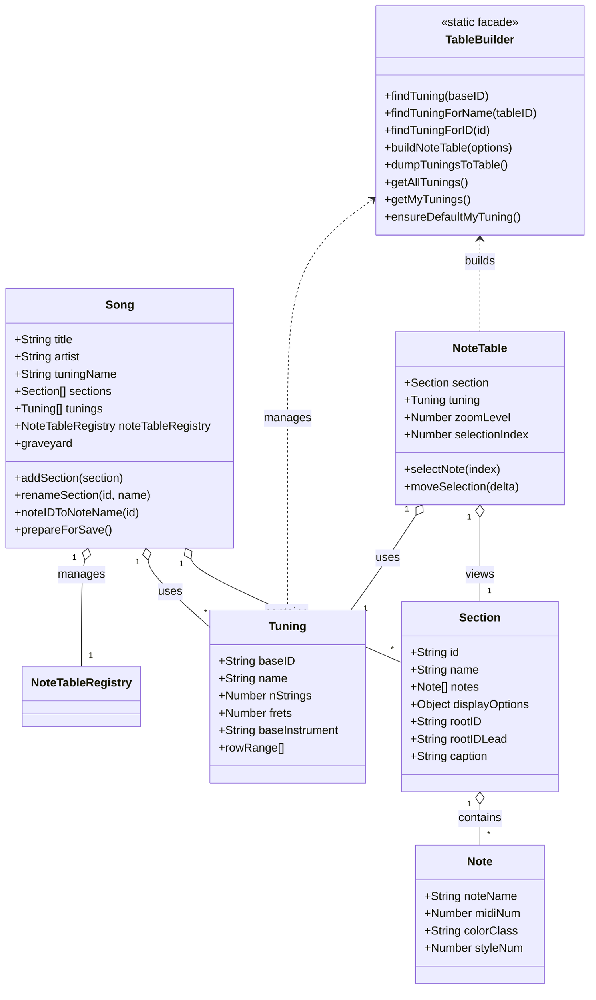

```mermaid
classDiagram
    class Song {
        +String title
        +String artist
        +String tuningName
        +Section[] sections
        +Tuning[] tunings
        +NoteTableRegistry noteTableRegistry
        +addSection(section)
        +renameSection(id, name)
        +noteIDToNoteName(id)
        +prepareForSave()
        +graveyard
    }

    class Section {
        +String id
        +String name
        +Note[] notes
        +Object displayOptions
        +String rootID
        +String rootIDLead
        +String caption
    }

    class NoteTable {
        +Section section
        +Tuning tuning
        +Number zoomLevel
        +Number selectionIndex
        +selectNote(index)
        +moveSelection(delta)
    }

    class TableBuilder {
        <<static facade>>
        +findTuning(baseID)
        +findTuningForName(tableID)
        +findTuningForID(id)
        +buildNoteTable(options)
        +dumpTuningsToTable()
        +getAllTunings()
        +getMyTunings()
        +ensureDefaultMyTuning()
    }

    class Tuning {
        +String baseID
        +String name
        +Number nStrings
        +Number frets
        +String baseInstrument
        +rowRange[]
    }

    class Note {
        +String noteName
        +Number midiNum
        +String colorClass
        +Number styleNum
    }

    Song "1" o-- "*" Section : contains
    Song "1" o-- "*" Tuning : uses
    Song "1" o-- "1" NoteTableRegistry : manages
    Section "1" o-- "*" Note : contains
    NoteTable "1" o-- "1" Section : views
    NoteTable "1" o-- "1" Tuning : uses
    TableBuilder <.. NoteTable : builds
    TableBuilder <.. Tuning : manages

```    