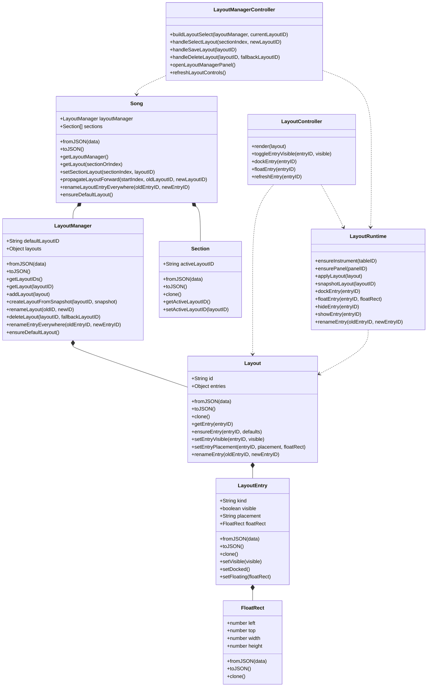

# LayoutManager Specification

This document defines the target design for persisted layouts of Instruments and Panels in infinite-neck.

It is intended to be the implementation reference for the first LayoutManager build and the maintenance reference for follow-on work.

## Status

- This is a design specification, not an implementation report.
- It supersedes the older idea of reviving arbitrary plain objects throughout runtime.
- It keeps Song and Section simple by persisting only model state, not UI widget state.

## Goals

1. Persist named layouts in the Song file.
2. Let each Section store only the ID of the Layout in effect.
3. Reuse a single live DOM instance per Instrument instead of rebuilding note tables on every visibility or float change.
4. Support both docked and floating placement.
5. Preserve placement metadata even when an entry is temporarily hidden.
6. Generalize the layout system so it can also manage Panels, not only Instrument tables.
7. Replace revive-style runtime repair with a clean fromJSON constructor tree.

## Non-Goals

1. This spec does not require a full desktop window manager.
2. This spec does not require z-order focus handling beyond the browser default.
3. This spec does not require immediate support for CSS flex or grid placement strategies, but it must leave room for them.
4. This spec does not require automatic garbage collection of hidden note data.

## Terminology

- Instrument: a note table backed by a Tuning and rendered into the DOM.
- Table ID: the stable persisted ID of an Instrument, such as `tblS6_1`.
- Panel: a non-Instrument UI surface that may be shown docked or floating, such as LayoutManager, Perfect4thsCalculator, or Score.
- Layout Entry: one persisted visibility and placement record for either an Instrument or a Panel.
- Active Layout: the named Layout selected for a Section.
- Layout Run: a contiguous sequence of Sections that currently share the same `activeLayoutID`.

## Core Design Decisions

## 1. Section persists only the Layout ID

Each Section persists only:

- `activeLayoutID`

It does not persist:

- the SELECT widget state
- DOM references
- float window references
- button state

This keeps Section lightweight even for Songs with many Sections.

## 2. Named Layouts are shared objects

A Layout is a named shared model object owned by Song through LayoutManager.

Editing a Layout is live and immediate:

- changing visibility updates the shared Layout immediately
- floating or docking updates the shared Layout immediately
- all Sections that reference that Layout ID will reflect the change when visited

There is no scratch copy of a Layout in Section.

## 3. Layout entries are keyed by stable entry ID

For Instruments, the key is the Instrument table ID such as `tblBass_1`.

For Panels, the key is a stable panel ID such as:

- `panelLayoutManager`
- `panelPerfect4thsCalculator`
- `panelScore`

This preserves the clean keyed-object design while allowing future panel support.

## 4. Hiding does not destroy placement

If a Layout Entry becomes hidden:

- the entry stays in the Layout
- its placement remains unchanged
- its last floating rectangle remains unchanged

When the user shows it again:

- if placement is `docked`, it returns docked
- if placement is `floating`, it returns to its saved rectangle

## 5. Layout application moves DOM instead of rebuilding DOM

The runtime must treat each Instrument DOM tree as a singleton per table ID.

Layout changes must use attach, detach, show, hide, dock, and float operations against that singleton DOM.

The layout system must not solve visibility by rebuilding note tables.

## 6. fromJSON replaces revive as the construction strategy

The runtime must stop depending on repeated revive calls on already-live objects.

Construction must happen only when raising object graphs from serialized data:

1. loading a Song from a song file
2. raising a buried object from the graveyard
3. cloning model objects through explicit constructor-tree cloning

Once constructed, a live object remains a live instance until it is discarded.

## Domain Model

## Song

Song remains the aggregate root.

New persisted responsibility:

- owns `layoutManager`

New non-persisted responsibility:

- owns or can access runtime collaborators that apply layouts to live DOM

Song remains responsible for rename propagation across persisted model state.

### Song API additions

- `static fromJSON(data, options)`
- `toJSON()`
- `getLayoutManager()`
- `getLayout(sectionOrIndex)`
- `setSectionLayout(sectionIndex, layoutID)`
- `propagateLayoutForward(startIndex, oldLayoutID, newLayoutID)`
- `renameLayout(layoutIDOld, layoutIDNew)`
- `deleteLayout(layoutID, fallbackLayoutID)`
- `renameLayoutEntryEverywhere(entryIDOld, entryIDNew)`
- `ensureDefaultLayout()`

## Section

Section gains one new persisted field:

- `activeLayoutID`

Section does not own Layout objects.

### Section API additions

- `static fromJSON(data, options)`
- `toJSON()`
- `clone()`
- `getActiveLayoutID()`
- `setActiveLayoutID(layoutID)`

## LayoutManager

LayoutManager is a persisted Song-owned container of named Layouts.

### Responsibilities

- create, store, rename, and delete named Layouts
- provide lookup by ID
- enforce unique layout IDs
- provide a default layout fallback
- propagate entry renames across all Layouts

### LayoutManager API

- `constructor({ layouts, defaultLayoutID })`
- `static fromJSON(data)`
- `toJSON()`
- `getLayoutIDs()`
- `hasLayout(layoutID)`
- `getLayout(layoutID)`
- `getDefaultLayoutID()`
- `setDefaultLayoutID(layoutID)`
- `addLayout(layout)`
- `createLayoutFromSnapshot(layoutID, snapshot)`
- `renameLayout(oldID, newID)`
- `deleteLayout(layoutID, fallbackLayoutID)`
- `renameEntryEverywhere(oldEntryID, newEntryID)`
- `ensureDefaultLayout()`

## Layout

Layout is a persisted named set of Layout Entries.

### Responsibilities

- own entry state for Instruments and Panels
- store visibility independent from placement
- preserve float rectangles while hidden

### Layout API

- `constructor({ id, entries })`
- `static fromJSON(data)`
- `toJSON()`
- `clone()`
- `getEntryIDs()`
- `hasEntry(entryID)`
- `getEntry(entryID)`
- `ensureEntry(entryID, defaults)`
- `setEntryVisible(entryID, visible)`
- `setEntryPlacement(entryID, placement, floatRect)`
- `renameEntry(oldEntryID, newEntryID)`
- `removeEntry(entryID)`
- `getVisibleDockedEntryIDs()`
- `getVisibleFloatingEntries()`

## LayoutEntry

LayoutEntry is a persisted value object.

### Fields

- `kind`: `instrument` or `panel`
- `visible`: boolean
- `placement`: `docked` or `floating`
- `floatRect`: nullable value object with `left`, `top`, `width`, `height`

### Rules

- Instrument entry IDs are table IDs.
- Panel entry IDs are stable panel IDs.
- If `visible` is false, `placement` and `floatRect` are retained.
- If `placement` is `docked`, `floatRect` may still remain from the last time it floated.

### LayoutEntry API

- `constructor({ kind, visible, placement, floatRect })`
- `static fromJSON(data)`
- `toJSON()`
- `clone()`
- `setVisible(visible)`
- `setDocked()`
- `setFloating(floatRect)`
- `updateFloatRect(floatRect)`

## FloatRect

FloatRect is a persisted value object.

### FloatRect API

- `constructor({ left, top, width, height })`
- `static fromJSON(data)`
- `toJSON()`
- `clone()`

## Runtime Architecture

The following runtime objects are not persisted in the Song file.

## LayoutRuntime

LayoutRuntime is the DOM-side application service.

### Responsibilities

- maintain one live DOM instance per Instrument table ID
- maintain panel hosts for panel IDs
- apply a Layout to live DOM
- snapshot live placement back into a Layout
- coordinate with dockable.js for floating hosts

### LayoutRuntime API

- `ensureInstrument(tableID)`
- `ensurePanel(panelID)`
- `applyLayout(layout)`
- `applyEntry(entryID, layoutEntry)`
- `snapshotLayout(layoutID)`
- `dockEntry(entryID)`
- `floatEntry(entryID, floatRect)`
- `hideEntry(entryID)`
- `showEntry(entryID)`
- `renameEntry(oldEntryID, newEntryID)`

## LayoutManagerController

LayoutManagerController owns the Section-page controls and the LayoutManager editing workflow.

### Responsibilities

- build the Layout SELECT for Section controls
- handle Save Layout, Delete Layout, Rename Layout actions
- launch the LayoutManager editor view
- apply selected Layouts through Song and LayoutRuntime
- decide whether to use direct calls or EventBus notifications for secondary observers

### LayoutManagerController API

- `buildLayoutSelect(layoutManager, currentLayoutID)`
- `handleSelectLayout(sectionIndex, newLayoutID)`
- `handleSaveLayout(layoutID)`
- `handleDeleteLayout(layoutID, fallbackLayoutID)`
- `openLayoutManagerPanel()`
- `refreshLayoutControls()`

## LayoutController

LayoutController owns the editor for a single Layout.

### Responsibilities

- show every known Instrument and supported Panel
- toggle visibility live
- float or dock entries live
- reflect immediate persisted changes to the current Layout

### LayoutController API

- `render(layout)`
- `toggleEntryVisible(entryID, visible)`
- `dockEntry(entryID)`
- `floatEntry(entryID)`
- `refreshEntry(entryID)`

## Dockable Host

The existing dockable.js module should shrink toward a thin host adapter.

### Responsibilities

- float one known element
- dock one known element
- read current float rectangle
- apply a saved float rectangle

It must not remain the source of truth for persisted layout state.

## Construction Tree

## Rule

The constructor tree for serialized data must be explicit and one-way.

There must be no expectation that plain JSON can be scattered through runtime and repaired later by repeated revive calls.

## Constructor Tree

### Song load from file

`Song.fromJSON(data)` will construct the entire persisted tree.

Expected call tree:

1. `Song.fromJSON(data)`
2. `LayoutManager.fromJSON(data.layoutManager)`
3. `Layout.fromJSON(layoutLike)` for each stored Layout
4. `LayoutEntry.fromJSON(entryLike)` for each stored Layout Entry
5. `FloatRect.fromJSON(rectLike)` when present
6. `Section.fromJSON(sectionLike)` for each Section
7. `SectionNotes.fromJSON(sectionNotesLike)` for each table entry
8. `Note.fromJSON(noteLike)` for any Note collections that need Note instances

### Graveyard raise

Graveyard storage may remain JSON-like snapshots.

Raising from the graveyard must use the same constructor-tree entry point:

- `Section.fromJSON(snapshot)`
- or `Song.fromJSON(snapshot)` for larger restores if ever needed

### Clone

Clone operations must use either:

- a purpose-built `clone()` tree
- or `toJSON()` followed by `fromJSON()`

They must not depend on object mutation plus revive.

## Section Layout Selection and Propagation

This area needs a precise rule so navigation is predictable.

## Persisted rule

Every Section persists a concrete `activeLayoutID`.

There is no runtime-only inherited Layout ID.

## User-facing rule

Changing the selected Layout on Section `N` updates a forward run of Sections.

The forward run is defined as:

- start at Section `N`
- remember the old Layout ID that was in effect at `N`
- rewrite `activeLayoutID` to the new Layout ID for Section `N` and each following Section
- stop when the first later Section is reached whose `activeLayoutID` is not the old Layout ID

This preserves the common expectation that a choice carries forward until a later deliberate change point.

## Why this rule

This satisfies the typical workflow:

1. set a Layout at the start of a song part
2. assume later untouched Sections in that part inherit it
3. navigate backward and forward without undefined surprises
4. preserve later intentional layout boundaries

## Default Layout Rules

LayoutManager must always be able to produce a valid fallback Layout ID.

### Requirements

- `defaultLayoutID` must name an existing Layout
- a new Song must create a default Layout automatically
- loading an older Song with no LayoutManager must synthesize a default Layout

### Missing reference handling

If a Section references a missing Layout ID:

1. use the default Layout
2. repair the Section to that default Layout ID in memory
3. persist the repaired value on the next save

This is a flow repair, not a normal success path.

## Visibility and Placement Rules

## Instruments

- default on clone or add: visible and docked
- hide does not delete note data
- hide does not delete the runtime DOM singleton
- hide does not delete floatRect

Docked order is always derived from `myTunings` order.

Layout does not persist a separate docked ordering for Instruments.

## Panels

Panels use the same LayoutEntry model.

What the panel displays is owned by the panel controller, not by Layout.

Examples:

- `panelLayoutManager`
- `panelPerfect4thsCalculator`
- `panelScore`

Whether a panel is section-relative or song-relative is a concern of that panel's controller, not of LayoutEntry.

## Rename and Delete Rules

## Tuning rename

Users may rename tunings in `myTunings` at any time.

Rename must propagate everywhere a stable table ID is persisted.

### Required rename targets

- Section note data keyed by table ID
- Song-level legacy visibility fields during migration if still present
- every Layout entry keyed by the old table ID
- any runtime registry keyed by the old table ID
- any wiring or related structures that persist table IDs

## Layout rename

- new Layout ID must be unique
- all Sections referencing the old Layout ID must be rewritten
- default Layout ID must be rewritten if it referenced the old ID

## Layout delete

Delete requires an explicit fallback Layout ID.

Delete flow:

1. choose the Layout to delete
2. choose a fallback Layout
3. rewrite all referencing Sections to the fallback
4. if deleted Layout was default, promote the fallback to default
5. remove the Layout

## Save Layout Flow

`Save Layout` is a snapshot action.

Expected behavior:

1. user enters a unique Layout ID near the Layout SELECT
2. controller snapshots the current live arrangement from LayoutRuntime
3. LayoutManager creates the named Layout
4. current Section becomes subscribed to that Layout ID
5. forward propagation applies using the standard propagation rule

If the name already exists, the save must be blocked unless an explicit overwrite mode is designed later.

The current specification requires unique names.

## UI Placement

## First implementation allowance

The first implementation may open the LayoutManager editor in an in-page DIV under Section controls if that significantly reduces bootstrap cost.

## Target implementation

The target implementation is a floating panel using the same general float-host system as other panels.

The layout model must be designed for the target implementation from the first revision even if the first UI is temporarily in-page.

## Direct Calls versus EventBus

The project uses both direct calls and EventBus effectively.

The recommended rule for LayoutManager work is:

- use direct calls for clear one-to-one control flow
- use EventBus only when multiple subscribers need the same domain event or when decoupling is genuinely useful

### Prefer direct calls for

- controller to Song model updates
- controller to LayoutRuntime application calls
- layout editor button handlers

### Prefer EventBus for

- `SectionChanged` notifications observed by several UI surfaces
- panel refresh notifications with multiple listeners
- tuning rename or add notifications when several independent controllers must react

The layout core should not depend on EventBus to maintain its own correctness.

## Persistence JSON Shapes

The following examples show the persisted model shape expected in the Song file.

## FloatRect JSON

```json
{
  "left": 12,
  "top": 24,
  "width": 1000,
  "height": 300
}
```

## LayoutEntry JSON for an Instrument

```json
{
  "kind": "instrument",
  "visible": true,
  "placement": "floating",
  "floatRect": {
    "left": 12,
    "top": 24,
    "width": 1000,
    "height": 300
  }
}
```

## LayoutEntry JSON for a Panel

```json
{
  "kind": "panel",
  "visible": true,
  "placement": "floating",
  "floatRect": {
    "left": 48,
    "top": 60,
    "width": 720,
    "height": 500
  }
}
```

## Layout JSON

```json
{
  "id": "FullBand",
  "entries": {
    "tblP4_1": {
      "kind": "instrument",
      "visible": true,
      "placement": "docked",
      "floatRect": null
    },
    "tblBass_1": {
      "kind": "instrument",
      "visible": true,
      "placement": "docked",
      "floatRect": null
    },
    "tblS6_1": {
      "kind": "instrument",
      "visible": false,
      "placement": "floating",
      "floatRect": {
        "left": 12,
        "top": 312,
        "width": 1000,
        "height": 300
      }
    },
    "panelScore": {
      "kind": "panel",
      "visible": true,
      "placement": "floating",
      "floatRect": {
        "left": 1100,
        "top": 80,
        "width": 720,
        "height": 840
      }
    }
  }
}
```

## LayoutManager JSON

```json
{
  "defaultLayoutID": "Default",
  "layouts": {
    "Default": {
      "id": "Default",
      "entries": {
        "tblS6_1": {
          "kind": "instrument",
          "visible": true,
          "placement": "docked",
          "floatRect": null
        }
      }
    },
    "FullBand": {
      "id": "FullBand",
      "entries": {
        "tblS6_1": {
          "kind": "instrument",
          "visible": true,
          "placement": "floating",
          "floatRect": {
            "left": 12,
            "top": 12,
            "width": 1000,
            "height": 300
          }
        },
        "panelLayoutManager": {
          "kind": "panel",
          "visible": true,
          "placement": "floating",
          "floatRect": {
            "left": 1040,
            "top": 12,
            "width": 480,
            "height": 640
          }
        }
      }
    }
  }
}
```

## Section JSON excerpt

Only the new layout-related field is shown here.

```json
{
  "caption": "Verse",
  "rootID": "3",
  "rootIDLead": "-1",
  "beats": 16,
  "currentBeat": 1,
  "sharps": false,
  "activeLayoutID": "FullBand",
  "sectionNotesByTable": {
    "tblS6_1": {
      "playedNotes": [],
      "namedNotes": {},
      "recordedNotes": {}
    }
  }
}
```

## Song JSON excerpt

Only the layout-related and nearby fields are shown here.

```json
{
  "songName": "All-Chords",
  "defaultBPM": "80",
  "theme": "OEM",
  "myTunings": [
    {
      "baseID": "S6_1",
      "caption": "Standard Guitar",
      "visible": true
    },
    {
      "baseID": "Bass_1",
      "caption": "Bass",
      "visible": true
    }
  ],
  "layoutManager": {
    "defaultLayoutID": "Default",
    "layouts": {
      "Default": {
        "id": "Default",
        "entries": {
          "tblS6_1": {
            "kind": "instrument",
            "visible": true,
            "placement": "docked",
            "floatRect": null
          },
          "tblBass_1": {
            "kind": "instrument",
            "visible": true,
            "placement": "docked",
            "floatRect": null
          }
        }
      },
      "PracticeGroup": {
        "id": "PracticeGroup",
        "entries": {
          "tblS6_1": {
            "kind": "instrument",
            "visible": true,
            "placement": "docked",
            "floatRect": null
          },
          "tblBass_1": {
            "kind": "instrument",
            "visible": false,
            "placement": "docked",
            "floatRect": null
          },
          "panelScore": {
            "kind": "panel",
            "visible": true,
            "placement": "floating",
            "floatRect": {
              "left": 1100,
              "top": 80,
              "width": 720,
              "height": 840
            }
          }
        }
      }
    }
  },
  "sections": [
    {
      "caption": "Verse 1",
      "activeLayoutID": "Default"
    },
    {
      "caption": "Verse 2",
      "activeLayoutID": "Default"
    },
    {
      "caption": "Practice Ending",
      "activeLayoutID": "PracticeGroup"
    }
  ]
}
```

## Mermaid UML

The following Mermaid block keeps the syntax intentionally simple for VS Code Markdown Preview Mermaid Support.



## Migration Notes

## Legacy song files without LayoutManager

When loading an older song file:

1. build a default LayoutManager
2. create a default Layout
3. seed Instrument entries from `myTunings`
4. mark entries visible when the legacy song indicates that the table was visible
5. assume docked placement for legacy entries unless a later migration source provides float rectangles
6. set every Section `activeLayoutID` to the default Layout ID

## Legacy visibility fields

Legacy fields such as `visibleNoteTables` are migration inputs only.

They should not remain the primary source of truth once LayoutManager is implemented.

NOTE: getting rid of visibleNoteTables is a priorty: as soon as there in an object that responds with an array of visible tables from a stable, well known API call, from the stable source of truth, visibleNoteTables should be ditched.

Another thing that should be considered is that getDefaultTuning has been a bear.  We really want a tuning present when someone comes into the app for the first time, but once someone has gained familiary, we really want to pick up the default instrument either from the URL query string, or from browser storage if enabled, the way we do for applyScalingPrefs() .  When opening a song, we can't tell if the user wanted the default tuning, so we haven't just ditched it.  However, in addition to myTunings in a loaded file, which become the truth for myTunings listing, there is a mode where if the checkbox is checked under on the open song button on the File page, sections are merged into the current song. In this mode, any myTunings must be preserved. Otherwise they should be cleaned out.

## Implementation Sequence

1. Add pure persisted model classes: `FloatRect`, `LayoutEntry`, `Layout`, `LayoutManager`.
2. Add `activeLayoutID` to Section.
3. Add `fromJSON` constructor tree for Song, Section, SectionNotes, and Note.
4. Add LayoutRuntime as the singleton DOM owner for Instruments and Panels.
5. Refactor dockable.js into a thin float-host adapter.
6. Add LayoutManagerController and LayoutController.
7. Replace checkbox-driven Instrument visibility with Layout editing.
8. Remove rebuild-all behavior from layout changes.

## Open Follow-Up Items

1. Decide whether the first LayoutManager editor ships as an in-page DIV or immediately as a float panel.
  - Answer: do in-page DIV.
2. Decide whether panel visibility editing may hide the LayoutManager panel while it is editing the current Layout, or whether that should be guarded in the first implementation.
  - Answer: first implementation don't worry about it.  A song can always be loaded with default Tuning, which defaults to docked, so debugging and design can always be reached.
3. Decide whether a future explicit `Copy Layout From Previous Section` action is worthwhile in addition to forward propagation.
  - Add to first spec.  It is useful when doing these template layouts to see the participating SELECTs, INPUTs and BUTTONs from the start.  And the implementation of the event is very similar to forward propogation, so we should be testing them together.
4. Decide when to introduce alternate placement modes such as flex or grid.
  - Answer: Defer.  flex and grid are such bears to work with, we'll target that when this work is stable and accepted.
5. If Layout .... "kind" is "instrument", support features as special properties: 
  - diamondsRow: boolean
  - leftCaption: boolean (if true, instrument will be built with an HTML block with two cells in one column:
    - a horizontal, left-to-right text span that has classes so that it functions as an indicator of Section, relativeSection, and Looper status:
      ```
      var sectionMark = '<span class="instrumentSectionBox LooperLight" id="relSec_'+Constants.TABLE_ID_PREFIX+options.baseID+'"></span>';
      ```
      renders as: 
      ```
      <span class="instrumentSectionBox LooperLight" id="relSec_tblS6_1"><span class="instrumentSectionMark">§</span>1</span>
      ```
    - a vertical, bottom-to-top text writing direction cell that contains the Tuning ID.