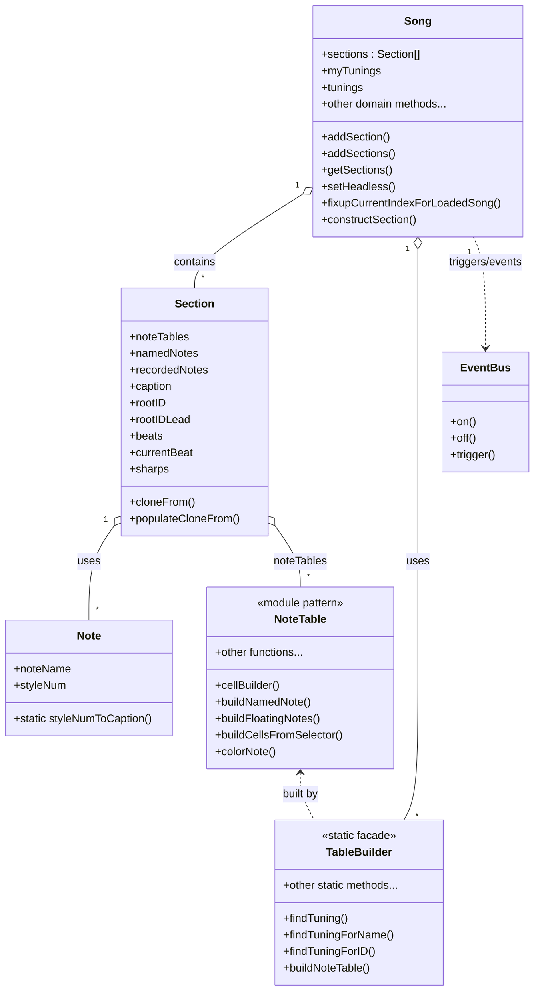

# Actual vs Expected Class Diagram

Below is a Mermaid class diagram showing the actual classes and relationships found in the codebase, as discovered by spelunking from the main entry points ( infinite-neck.js::appInit and _tests/jest/song-api-load.test.js which calls infinite-neck.js::setupSongTests() ). This diagram is suitable for comparison with the expected diagrams in class-diagram.md and note-types-class-diagram.md in this same directory.

- This diagram reflects only actual JavaScript classes and their relationships as found in the codebase, omitting legacy, utility, and provider-pattern modules.

