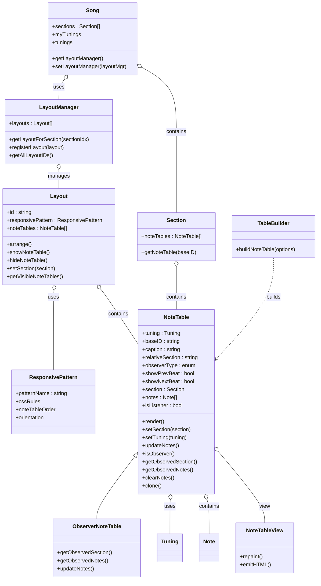

# Title: NoteTable as a real Object, generated Planning Document

## Document Version

- version: V2

## Mermaid Class Diagram: Proposed NoteTable Refactor (V2)

## Planning: Moving Towards NoteTable as a First-Class Object

### Overview
This document analyzes the changes needed to move from the current procedural/module pattern for NoteTable to a true object-oriented, first-class NoteTable model, as described in _doco/design/notetable-as-real-object.md. It references the current and target class diagrams and the codebase.

---

### 1. New Classes to Introduce

#### 1.1. `NoteTable` (new class)
- **Purpose:** Represents an instrument instance ("table") in the UI and domain model.
- **Key Properties:**
  - `tuning` (Tuning)
  - `baseID` (string)
  - `caption` (string)
  - `relativeSection` (string, e.g. "^2", "0")
  - `observerType` (enum: Normal, Observer)
  - `isListener` (bool)
  - `showPrevBeat`, `showNextBeat` (bool)
  - `section` (Section reference)
  - `notes` (array of Note)
  - `noteTableView` (NoteTableView)
- **Key Methods:**
  - `render()`
  - `setSection(section)`
  - `setTuning(tuning)`
  - `updateNotes()`
  - `isObserver()`
  - `getObservedSection()`
  - `getObservedNotes()`
  - `clearNotes()`
  - `clone()`

#### 1.2. `NoteTableView` (new class)
- **Purpose:** View class for NoteTable, responsible for emitting HTML.
- **Key Methods:**
  - `repaint()`
  - `emitHTML()`

#### 1.3. `LayoutManager` (new class)
- **Purpose:** Maintains a list of Layout.ID values used anywhere in the Song, maps Section index to Layout, manages registration.
- **Key Properties:**
  - `layouts` (array of Layout)
- **Key Methods:**
  - `getLayoutForSection(sectionIdx)`
  - `registerLayout(layout)`
  - `getAllLayoutIDs()`

#### 1.4. `Layout` (new class)
- **Purpose:** Knows which NoteTable objects are included and visible, emits blocks of HTML from NoteTableView into DIVs per ResponsivePattern.
- **Key Properties:**
  - `id` (string)
  - `responsivePattern` (ResponsivePattern)
  - `noteTables` (array of NoteTable)
- **Key Methods:**
  - `arrange()`
  - `showNoteTable()`
  - `hideNoteTable()`
  - `setSection(section)`
  - `getVisibleNoteTables()`

#### 1.5. `ResponsivePattern` (new class)
- **Purpose:** Specifies CSS layout, NoteTable order, orientation, etc.
- **Key Properties:**
  - `patternName` (string)
  - `cssRules`
  - `noteTableOrder`
  - `orientation`

#### 1.6. `ObserverNoteTable` (subclass)
- **Purpose:** Specialized NoteTable for observer behavior (look-ahead/look-behind).
- **Key Methods:**
  - `getObservedSection()` (override)
  - `getObservedNotes()` (override)
  - `updateNotes()` (override)

#### 1.7. Listener (role/property)
- **Purpose:** Not a class; a NoteTable or ObserverNoteTable can have `isListener=true` and listen to another NoteTable in the same Section.

---

### 2. Existing Classes to Modify

#### 2.1. `Section`
- **Add:**
  - Remove direct management of noteTables as plain objects; instead, reference NoteTable instances.
  - Methods to get/set NoteTables by ID, type, or role.
  - Possibly: `getNoteTable(baseID)`

#### 2.2. `Song`
- **Add:**
  - Awareness of LayoutManager and NoteTable objects.
  - Methods to get/set LayoutManager, enumerate instruments, etc.
  - Possibly: `getLayoutManager()`, `setLayoutManager(layoutMgr)`

#### 2.3. `TableBuilder`
- **Modify:**
  - Refactor to be a pure builder/factory for NoteTable objects, not a static utility for DOM manipulation.
  - Methods: `buildNoteTable(options)` returns a NoteTable instance.

#### 2.4. `notetable.js` (module)
- **Refactor:**
  - Move procedural logic into NoteTable and NoteTableView class methods.
  - Remove global provider pattern; use instance methods and dependency injection.

---

### 3. Methods to Add/Refactor

- `NoteTable.render()` — Handles DOM rendering for this instrument.
- `NoteTable.setSection(section)` — Sets which Section this NoteTable observes.
- `NoteTable.updateNotes()` — Updates notes based on Section, Tuning, and observer/listener logic.
- `NoteTableView.repaint()` — Emits HTML for a NoteTable.
- `Layout.arrange()` — Lays out NoteTables in the UI.
- `Section.getNoteTable(baseID)` — Returns the NoteTable for a given instrument.
- `Song.getLayoutManager()` — Returns the current LayoutManager.
- `TableBuilder.buildNoteTable(options)` — Returns a NoteTable instance.

---

### 4. Migration/Transition Steps

1. Introduce the NoteTable and NoteTableView classes and migrate one instrument to use them.
2. Refactor Section to reference NoteTable instances.
3. Implement LayoutManager and Layout classes to manage NoteTables and layouts.
4. Gradually move procedural code from notetable.js into NoteTable and NoteTableView methods.
5. Update TableBuilder to construct NoteTable objects.
6. Add ObserverNoteTable as needed; implement Listener as a role/property.
7. Update UI and event handling to use NoteTable, NoteTableView, Layout, and LayoutManager objects.

---

### 5. Open Questions
- How will persistence (JSON save/load) handle NoteTable, Layout, and LayoutManager instances?
- How will legacy code that expects plain objects be migrated?
- What is the best way to handle observer/listener relationships in the UI and data model?
- How will NoteTableView and ResponsivePattern interact for complex layouts?

---

## References
- [notetable-as-real-object.md](notetable-as-real-object.md)
- [class-diagram.md](class-diagram.md)
- [class-diagram-20260316.md](class-diagram-20260316.md)
