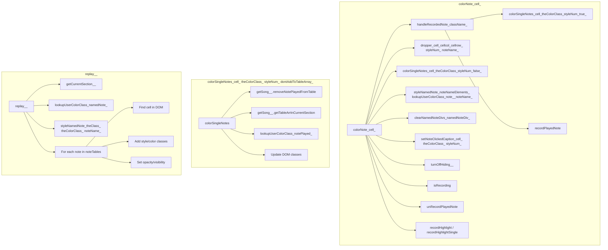

```mermaid
graph TD
  A[DOM Ready] --> B[appInit]
  B --> C1[gSong = new Song]
  B --> C2[getSong.graveyard = makeGraveyard]
  B --> C3[installDefaultColorDicts]
  B --> C4[applyStylesheetsTo_gUserColorDict]
  B --> C5[buildColorDicts]
  B --> C6[TuningsLibrary.ensureDefaultMyTuning]
  B --> C7[installAllTuningsTables]
  B --> C8[installBtnHamburgerClicks]
  B --> C9[setupOpenFile]
  B --> C10[sectionChanged]
  B --> C11[installTDNoteClick]
  B --> C12[bindDesktopEvents]
  B --> C13[applyScalingPrefs]
  B --> C14[rebuildThemesDropdown]
  B --> C15[update font label, build user colors, install color change events]
  B --> C16[reloadAllTuningsDisplay]
  B --> C17[TuningsLibrary.showDefaultTuning]
  B --> C18[TuningsLibrary.bindFormTuningsEvents]
  B --> C19[bindDataActionHandlers]
  B --> C20[Trigger initial UI events]
  B --> C21[Bind document keypress/keyup]

  C12 --> D1[Wire up UI controls]
  C12 --> D2[Wire up menu buttons]
  C12 --> D3[Wire up section controls]
  C12 --> D4[Wire up transport, color pickers, etc.]

  C19 --> E1[Wire up data-action elements]
  C19 --> E2[Actions: songLibrary, showGraveyard, loadSong, etc.]

  C10 --> F1[displayOptionsToControls]
  C10 --> F2[update highlights]
  C10 --> F3[updateSectionsStatus]

  C9 --> G1[File input event]
  G1 --> G2[openSong]
  G2 --> G3[updateAfterOpenSong]

  C14 --> H1[bindThemeEvents]
```

  Searched codebase for "main function entry point infinite-neck.js call tree", 24 results

Read , lines 1 to 80

Read , lines 81 to 300

Read , lines 1980 to 2400

Read , lines 301 to 900

Read , lines 901 to 1400

Read , lines 1401 to 1980

Read , lines 2100 to 2325

Here is a high-level call tree for the main app in infinite-neck.js, focusing on the browser startup and main orchestration:

---

**Entry Point:**
- On DOM ready, calls `appInit()`.

**appInit()**
- Sets up global error handler
- Loads version info
- Instantiates main Song model (`gSong = new Song()`)
- Initializes graveyard: `getSong().graveyard = makeGraveyard()`
- Installs default color dictionaries: `installDefaultColorDicts()`
- Applies user color stylesheets: `applyStylesheetsTo_gUserColorDict()`
- Builds color dictionaries: `buildColorDicts()`
- Hides color dict UI, custom editors
- Ensures default tuning: `TuningsLibrary.ensureDefaultMyTuning(getStartupTuningBaseID('S6'))`
- Installs all tuning tables: `installAllTuningsTables()`
- Installs hamburger/menu button handlers: `installBtnHamburgerClicks()`
- Sets up file open handler: `setupOpenFile()`
- Calls `sectionChanged()` to update UI for current section
- Installs note click handlers: `installTDNoteClick()`
- Binds all desktop UI events: `bindDesktopEvents()`
- Applies scaling preferences: `applyScalingPrefs(true)`
- Rebuilds theme dropdown and binds theme events: `rebuildThemesDropdown()`
- Sets up default theme and UI state
- Sets up function symbol textarea
- Updates song name and UI captions
- Hides/initializes various UI elements
- Updates font label, builds user colors, installs color change events
- Reloads all tunings display, shows default tuning, binds tuning form events
- Binds data-action handlers: `bindDataActionHandlers()`
- Triggers initial UI events (e.g., `$("#btnFlats").click()`)
- Binds document keypress/keyup handlers

---

**Major Event/Action Handlers:**
- **bindDesktopEvents()**: Wires up all UI controls, buttons, and input events to their handlers (e.g., color pickers, menu buttons, section controls, transport, etc.)
- **bindDataActionHandlers()**: Wires up `[data-action]` elements to their corresponding functions (e.g., songLibrary, showGraveyard, loadSong, etc.)
- **sectionChanged()**: Updates UI and state for the current section, calls `displayOptionsToControls()`, updates highlights, and section status.
- **resetNoteNames()**: Rebuilds note labels and triggers a UI repaint.
- **installModuleProviders()**: Wires up cross-module provider functions for dependency injection.

---

**File Open/Save:**
- **setupOpenFile()**: Handles file input for loading songs.
- **openSong()**: Loads song data, updates model, rehydrates UI, calls `updateAfterOpenSong()`.
- **updateAfterOpenSong()**: Reapplies color dicts, themes, UI state, and triggers a repaint.

---

**UI/Model Sync:**
- **displayOptionsToControls()** and **controlsToDisplayOptions()**: Sync UI controls with section display options.
- **replay(), clearAll(), fullRepaint()**: Redraws the main note tables and UI.

---

**Summary:**  
The app is orchestrated by `appInit()`, which sets up the model, UI, event handlers, and initial state. Most user actions are handled via jQuery event bindings that call exported functions in infinite-neck.js, which in turn update the model and trigger UI updates.

If you want a visual diagram or a more detailed breakdown of a specific branch (e.g., song loading, section switching, or UI event flow), let me know!

==================

Searched codebase for "colorNote function call tree", 14 results

Searched codebase for "colorSingleNotes function call tree", 12 results

Searched codebase for "replay function call tree", 22 results

Here is a call tree and summary for each of the three key functions in NoteTableController.js:

---

### 1. `colorNote(cell)`

**Call Tree:**
- colorNote(cell)
  - (local) handleRecordedNote(className)
    - colorSingleNotes(cell, theColorClass, styleNum, true)
    - recordPlayedNote(sBeatNum, thatNote)
  - dropper(cell, cellcol, cellrow, styleNum, noteName)
  - colorSingleNotes(cell, theColorClass, styleNum, false)
  - styleNamedNote(noteNameElements, lookupUserColorClass(note), noteName)
  - clearNamedNoteDivs(namedNoteDiv)
  - setNoteClickedCaption(cell, theColorClass, styleNum)
  - turnOffHiding()
  - isRecording()
  - unRecordPlayedNote(sBeatNum, proxyNote)
  - recordHighlight / recordHighlightSingle

**Key Logic:**
- Determines the type of note action (named, single, tiny, fingering, highlight, etc.) based on UI state.
- Handles toggling, coloring, and erasing notes in the UI and model.
- Calls `colorSingleNotes` for single/tiny/fingering notes.
- Calls `dropper` for color picking.
- Updates the model (`namedNotes`, `noteTables`) and UI classes.

---

### 2. `colorSingleNotes(cell, theColorClass, styleNum, dontAddToTableArray)`

**Call Tree:**
- colorSingleNotes(cell, theColorClass, styleNum, dontAddToTableArray)
  - getSong().removeNotePlayedFromTable(notePlayed, parentTableID)
  - getSong().getTableArrInCurrentSection(parentTableID)
  - lookupUserColorClass(notePlayed)
  - Updates DOM classes for .tinyNote, .singleNote, .Fingering, etc.

**Key Logic:**
- Handles coloring and updating of single, tiny, bend, and fingering notes.
- Updates the current section's note tables.
- Ensures only one instance of a note is present per style.
- Applies color and style classes to the correct DOM elements.

---

### 3. `replay()`

**Call Tree:**
- replay()
  - getCurrentSection()
  - lookupUserColorClass(namedNote)
  - styleNamedNote(theClass, theColorClass, noteName)
  - For each note in noteTables:
    - Finds the correct cell in the DOM
    - Adds appropriate classes for style and color
    - Sets opacity and visibility

**Key Logic:**
- Redraws all notes for the current section based on the model.
- Applies color and style classes to all relevant DOM elements.
- Hides or shows notes based on UI toggles (hideNamedNotes, hideTinyNotes, etc.).
- Does not call getCurrentSection() more than once (encapsulation is preserved).

---

**Summary:**  
- `colorNote` is the main entry for user actions on notes, dispatching to helpers based on context.
- `colorSingleNotes` is the core for updating single/tiny/fingering notes in both the model and UI.
- `replay` is the main redraw function, syncing the UI to the current model state.

Would you like a Mermaid diagram for these call trees?