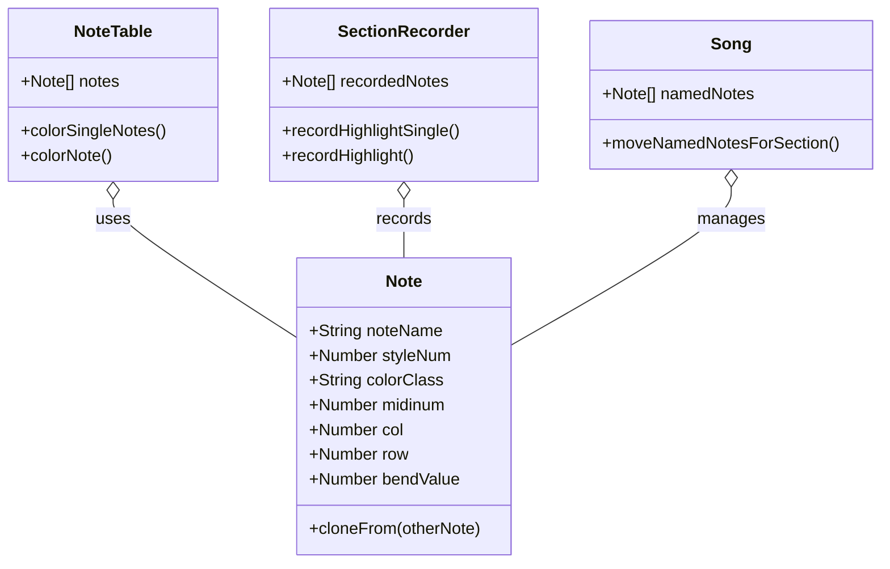

# Note Types Class Diagram

Below is a Mermaid class diagram based on the properties and methods inferred from note-types.txt for the classes NoteTable, SectionRecorder, and Song. Properties are taken from the note object usage, and methods are inferred from the function names and context.



- Properties and methods are inferred from the code snippets in note-types.txt.
- Relationships are based on usage: NoteTable and SectionRecorder use or record Note objects, Song manages named notes.

# Discussion

- In the code, these note types are handled in this way:
```
notetable.js
    :: colorSingleNotes
        var notePlayed = newNote();
            notePlayed.noteName = noteName;
            notePlayed.styleNum = styleNum;
            notePlayed.colorClass = theColorClass;
            notePlayed.midinum = midinum;
            notePlayed.col = c;
            notePlayed.row = r;
        
    :: colorNote
        var note = newNote();
            note.noteName = noteName;
            note.styleNum = styleNum;
            note.colorClass = theColorClass;


section-recorder.js 
    :: recordHighlightSingle 
        //"HighlightSingle" notes can't have a colorClass, their color is "Highlight"
        var recNote = newNote();
            recNote.noteName = noteName; 
            recNote.styleNum = styleNum;
            recNote.midinum = midinum;
            recNote.row = cellrow;

     :: recordHighlight
        //"HighlightSingle" notes can't have a colorClass, their color is "Highlight"
        var recNote = newNote();
            recNote.noteName = noteName;    
            recNote.styleNum = styleNum;
            recNote.midinum = midinum;
            recNote.row = cellrow;

song.js:
    moveNamedNotesForSection
        var clonedNote = newNote();
            clonedNote.cloneFrom(otherNote);
            clonedNote.noteName = transposedNoteName;
            

        Specifically:
            var otherNote = namedNotes[noteName];
            if (otherNote.colorClass){
                var clonedNote = newNote();
                clonedNote.cloneFrom(otherNote);
                clonedNote.noteName = transposedNoteName;
                namedNotesClone[transposedNoteName] = clonedNote;
            }

And somewhere the "bendValue" property is set .           


```
