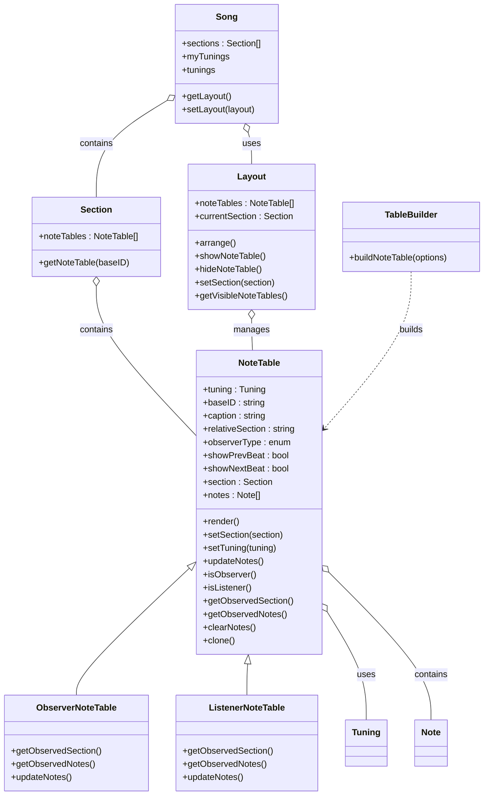

#
# Mermaid Class Diagram: Proposed NoteTable Refactor

# Planning: Moving Towards NoteTable as a First-Class Object

## Overview
This document analyzes the changes needed to move from the current procedural/module pattern for NoteTable to a true object-oriented, first-class NoteTable model, as described in _doco/design/notetable-as-real-object.md. It references the current and target class diagrams and the codebase.

---

## 1. New Classes to Introduce

### 1.1. `NoteTable` (new class)
- **Purpose:** Represents an instrument instance ("table") in the UI and domain model.
- **Key Properties:**
  - `tuning` (Tuning)
  - `baseID` (string)
  - `caption` (string)
  - `relativeSection` (string, e.g. "^2", "0")
  - `observerType` (enum: Normal, Observer, Listener)
  - `showPrevBeat`, `showNextBeat` (bool)
  - `section` (Section reference)
  - `notes` (array of Note)
- **Key Methods:**
  - `render()`
  - `setSection(section)`
  - `setTuning(tuning)`
  - `updateNotes()`
  - `isObserver()`
  - `isListener()`
  - `getObservedSection()`
  - `getObservedNotes()`
  - `clearNotes()`
  - `clone()`

### 1.2. `Layout` (new class)
- **Purpose:** Manages which NoteTables (instruments) are visible in `#tabledest`, their arrangement, and their relationship to Sections.
- **Key Properties:**
  - `noteTables` (array of NoteTable)
  - `currentSection` (Section)
- **Key Methods:**
  - `showNoteTable(noteTable)`
  - `hideNoteTable(noteTable)`
  - `setSection(section)`
  - `arrange()`
  - `getVisibleNoteTables()`

### 1.3. `ObserverNoteTable` and `ListenerNoteTable` (subclasses)
- **Purpose:** Specialized NoteTable variants for observer/listener behavior.
- **Key Methods:**
  - `getObservedSection()` (override)
  - `getObservedNotes()` (override)
  - `updateNotes()` (override)

---

## 2. Existing Classes to Modify

### 2.1. `Section`
- **Add:**
  - Remove direct management of noteTables as plain objects; instead, reference NoteTable instances.
  - Methods to get/set NoteTables by ID, type, or role.
  - Possibly: `getNoteTable(baseID)`

### 2.2. `Song`
- **Add:**
  - Awareness of Layout and NoteTable objects.
  - Methods to get/set Layout, enumerate instruments, etc.
  - Possibly: `getLayout()`, `setLayout(layout)`

### 2.3. `TableBuilder`
- **Modify:**
  - Refactor to be a pure builder/factory for NoteTable objects, not a static utility for DOM manipulation.
  - Methods: `buildNoteTable(options)` returns a NoteTable instance.

### 2.4. `notetable.js` (module)
- **Refactor:**
  - Move procedural logic into NoteTable class methods.
  - Remove global provider pattern; use instance methods and dependency injection.

---

## 3. Methods to Add/Refactor

- `NoteTable.render()` — Handles DOM rendering for this instrument.
- `NoteTable.setSection(section)` — Sets which Section this NoteTable observes.
- `NoteTable.updateNotes()` — Updates notes based on Section, Tuning, and observer/listener logic.
- `Layout.arrange()` — Lays out NoteTables in the UI.
- `Section.getNoteTable(baseID)` — Returns the NoteTable for a given instrument.
- `Song.getLayout()` — Returns the current Layout.
- `TableBuilder.buildNoteTable(options)` — Returns a NoteTable instance.

---

## 4. Migration/Transition Steps

1. Introduce the NoteTable class and migrate one instrument to use it.
2. Refactor Section to reference NoteTable instances.
3. Implement Layout class to manage NoteTables.
4. Gradually move procedural code from notetable.js into NoteTable methods.
5. Update TableBuilder to construct NoteTable objects.
6. Add ObserverNoteTable and ListenerNoteTable as needed.
7. Update UI and event handling to use NoteTable and Layout objects.

---

## 5. Open Questions
- How will persistence (JSON save/load) handle NoteTable instances?
- How will legacy code that expects plain objects be migrated?
- What is the best way to handle observer/listener relationships in the UI and data model?

---

## References
- [notetable-as-real-object.md](notetable-as-real-object.md)
- [class-diagram.md](class-diagram.md)
- [class-diagram-20260316.md](class-diagram-20260316.md)
