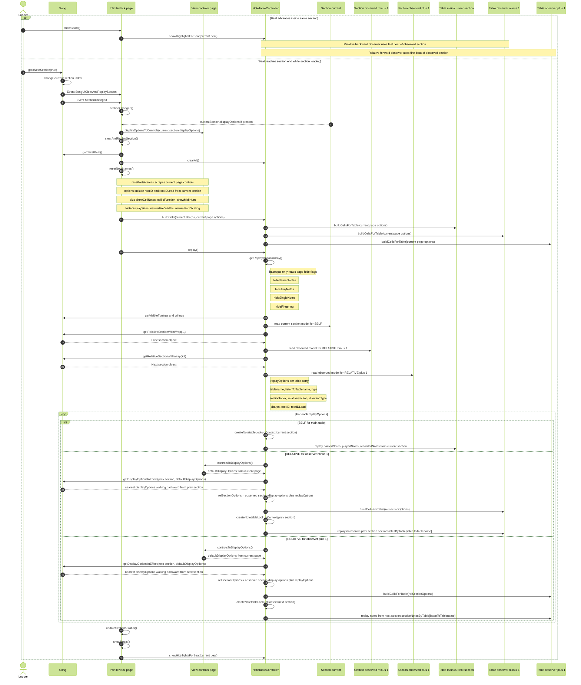
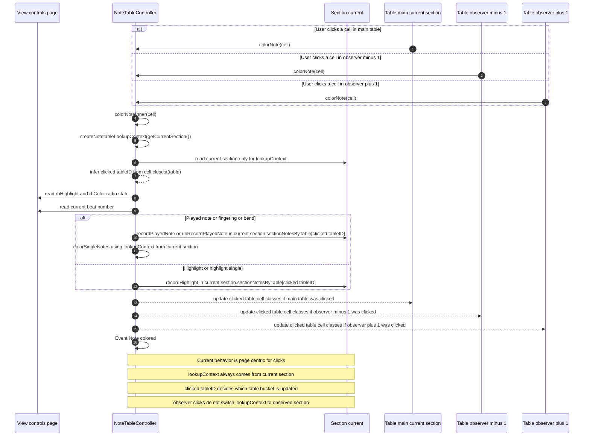

# Instrument Observers Sequence Diagram

This document describes the current flow as coded on 2026-05-06.

Key current behavior:

- The page view controls are global DOM state.
- `sectionChanged()` applies the current section `displayOptions` back into those page controls if present.
- `resetNoteNames()` scrapes the page controls and rebuilds all visible tables from one shared current-page options object.
- `replay()` then builds an options array per visible table.
- Relative observers use model data from the observed section for `sharps`, `rootID`, and `rootIDLead`.
- Relative observers also merge display options by calling `controlsToDisplayOptions()` and then `song.getDisplayOptionsInEffect(observedSection, defaultDisplayOptions)`.
- `colorNote()` always creates its lookup context from the current section, even if the clicked cell came from an observer table.

## Looping and Replay

## Cell Click and colorNote

## Current Flow Summary

- `Looper` advances the song section through `song.gotoNextSection(true)`.
- `Song` asks the page to `clearAndReplaySection()` through EventBus.
- `sectionChanged()` first revives page controls from the current section `displayOptions` if present.
- `resetNoteNames()` rebuilds all visible tables from one current-page options object.
- `getReplayOptionsArray()` then creates one `SELF` replayOptions for the main table and one `RELATIVE` replayOptions for each observer table.
- For relative observers, `replayTable()` currently re-scrapes page controls and then replaces them with `getDisplayOptionsInEffect(observedSection, defaultDisplayOptions)` before rebuilding that observer table.
- `colorNote()` is current-section centric for lookup context and recording, even when the clicked DOM cell is on an observer table.
