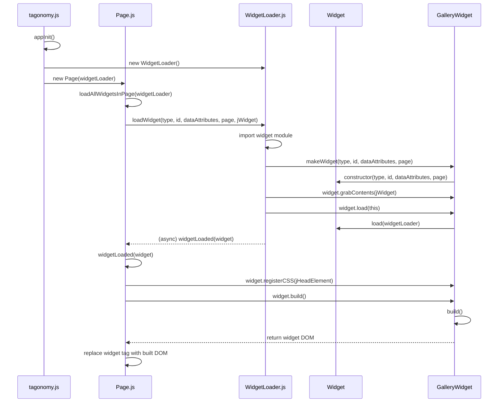

## Widget Loading Sequence Diagram

```mermaid
sequenceDiagram
	participant tagonomy.js
	participant Page.js
	participant WidgetLoader.js
	participant Widget
	participant GalleryWidget

	tagonomy.js->>tagonomy.js: appInit()
	tagonomy.js->>WidgetLoader.js: new WidgetLoader()
	tagonomy.js->>Page.js: new Page(widgetLoader)
	Page.js->>Page.js: loadAllWidgetsInPage(widgetLoader)
	Page.js->>WidgetLoader.js: loadWidget(type, id, dataAttributes, page, jWidget)
	WidgetLoader.js->>WidgetLoader.js: import widget module
	WidgetLoader.js->>GalleryWidget: makeWidget(type, id, dataAttributes, page)
	GalleryWidget->>Widget: constructor(type, id, dataAttributes, page)
	WidgetLoader.js->>GalleryWidget: widget.grabContents(jWidget)
	WidgetLoader.js->>GalleryWidget: widget.load(this)
	GalleryWidget->>Widget: load(widgetLoader)
	WidgetLoader.js-->>Page.js: (async) widgetLoaded(widget)
	Page.js->>Page.js: widgetLoaded(widget)
	Page.js->>GalleryWidget: widget.registerCSS(jHeadElement)
	Page.js->>GalleryWidget: widget.build()
	GalleryWidget->>GalleryWidget: build()
	GalleryWidget-->>Page.js: return widget DOM
	Page.js->>Page.js: replace widget tag with built DOM
```
